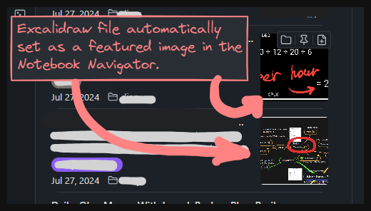

> [!NOTE]
>
> This repo contains an experimental excalidraw support that does not exist in the original project.<br>
> See: [Issue: [FR] Add Excalidraw Featured Image Support (closed as not-planned)](https://github.com/johansan/notebook-navigator/issues/384)
>
> 

> [!NOTE]
>
> For the full changelog including available features in the fork, see [releases](https://github.com/psxvoid/notebook-navigator/releases).

## Installation (The Forked Version)

1. Install [BRAT](https://obsidian.md/plugins?search=brat) obsidian plugin.
2. Go to obsidian settings > community plugins, find BRAT plugin and press a cog icon to go to it's settings.
3. Hit "Add beta plugin" button.
4. In the opened popup paste `https://github.com/psxvoid/notebook-navigator.git`.
5. Select the version you want to install (stable or pre-release).
6. Ensure "Enable after installing the plugin" checkbox is set.
7. Hit "Add plugin" button.

> [!NOTE]
>
> This forked version doesn't work when the original plugin is turned on.
> To use it, disable or uninstall the original, then install/enable this one.

> [!NOTE]
>
> To migrate settings from the original plugin, go to your vault, then into
> `.obsidian/plugins` folder, then find `notebook-navigator`. Inside that folder
> find and copy `data.json` into `.obsidian/plugins/notebook-navigator-ex`.

##

Below is the description from the original repository.

<!-- DOCUMENTATION_START -->

## Introduction to Notebook Navigator

[](https://www.youtube.com/watch?v=0lXbEHKDLp8)

## Installation

1. **Install Obsidian** - Download and install from [obsidian.md](https://obsidian.md/)
2. **Enable community plugins** - Go to Settings → Community plugins → Turn on community plugins
3. **Install Notebook Navigator** - Click "Browse" → Search for "Notebook Navigator" → Install
4. **Install Featured Image** - For automatic thumbnail generation, install [Featured Image](https://github.com/johansan/obsidian-featured-image) plugin to create optimized thumbnails for all your documents

For precise image management, consider also installing [Pixel Perfect Image](https://github.com/johansan/pixel-perfect-image) which lets you resize images to exact pixel dimensions and perform advanced image operations.

<br>

## Getting started

**Can't see your files?** If you've enabled dual-pane layout but don't see any files, you may need to resize the navigation pane. Drag the divider between the left pane and editor to reveal the file list.

### Navigation pane toolbar


1. **Shortcuts** - Jump to shortcuts section at the top of the navigation pane. This button is not visible if you have disabled shortcuts
2. **Collapse/Expand all** - Collapse or expand folders and tags (keeps selected item expanded by default). Configurable in settings if you want the button to affect folders, tags or both
3. **Show hidden** - Toggle visibility of excluded folders and hidden tags. This button is not visible if you have do not have any hidden items.
4. **Reorder root folders** - Open drag-and-drop interface to customize root folder order
5. **New folder** - Create a new folder in the currently selected location

### List pane toolbar


1. **Search** - Filter files by name or tag or search full-text with Omnisearch (if installed). Check plugin settings for details how to use search
2. **Show descendants** - Toggle display of notes from subfolders and subtags. Disable this to only see notes and files in the current folder or tag
3. **Sort** - Change sort order (date modified, date created, or title)
4. **Appearance** - Customize display settings for current folder/tag (preview rows, title rows, slim mode)
5. **New note** - Create a new note in the currently selected folder

### Drag and drop

- Drag files between folders to move them
- Drag files to tags to add tags
- Drag files to "Untagged" to remove all tags
- Drag files to shortcuts to add them to shortcuts
- Drag files from shortcuts to remove from shortcuts
- Drag shortcuts to reorder them
- Drag root folders when in reorder mode

## Keyboard shortcuts

| Key                                         | Action                                                                                                            |
| ------------------------------------------- | ----------------------------------------------------------------------------------------------------------------- |
| ↑/↓                                         | Navigate up/down in current pane                                                                                  |
| ←                                           | In navigation pane: collapse or go to parent<br>In list pane: switch to navigation pane                           |
| →                                           | In navigation pane: expand or switch to list pane<br>In list pane: switch to editor                               |
| Tab                                         | In navigation pane: switch to list pane<br>In list pane: switch to editor<br>In search field: switch to list pane |
| Shift+Tab                                   | In list pane: switch to navigation pane<br>In search field: switch to navigation pane                             |
| Enter                                       | In search field: switch to list pane                                                                              |
| Escape                                      | In search field: close search and focus list pane                                                                 |
| PageUp/PageDown                             | Scroll up/down in navigation pane and list pane                                                                   |
| Home/End                                    | Jump to first/last item in current pane                                                                           |
| Delete (Windows/Linux)<br>Backspace (macOS) | Delete selected item                                                                                              |
| Cmd/Ctrl+A                                  | Select all notes in current folder                                                                                |
| Cmd/Ctrl+Click                              | Toggle notes selection                                                                                            |
| Shift+Click                                 | Select a range of notes                                                                                           |
| Shift+Home/End                              | Select from current position to first/last item                                                                   |
| Shift+↑/↓                                   | Extend selection up/down                                                                                          |

**Note:** All keyboard shortcuts can be customized by editing the `keyboardShortcuts` section in `.obsidian/plugins/notebook-navigator/data.json`. You can add VIM-style navigation (h,j,k,l) or assign multiple keys to the same command.

<br>

## Features


### Interface

- **Dual-pane layout** - Navigation pane on the left (folders and tags), list pane on right (files)
- **Single-pane layout** - Default on mobile, optional on desktop. Switch between navigation and file list
- **Customizable startup view** - Choose between Navigation view (shortcuts, recent notes, folders) or Notes list view as default
- **Mobile optimized** - Touch-friendly interface with properly sized buttons for Android, iOS and iPadOS
- **Multi-language support** - English, Deutsch, Español, Français, Polski, 日本語, 中文, 한국어
- **RTL language support** - Right-to-left languages with proper layout mirroring (e.g., العربية)
- **Resizable panes** - Adjust the split between navigation and list pane

### Navigation

- **Shortcuts** - Pin frequently used notes, folders, tags, and saved searches for quick access
- **Recent notes** - Track and display recently opened notes (configurable 1-10)
- **Hierarchical folder tree** - Browse nested folders with expand/collapse controls
- **Hierarchical tag tree** - Browse nested tags with parent/child relationships (e.g., `projects/work/urgent`)
- **Auto-reveal active file** - Automatically expand folders and scroll to current file
- **Auto-expand on drag** - Folders and tags automatically expand when dragging files over them
- **Breadcrumb navigation** - Click any segment in the header path to jump to parent folders or tags
- **Keyboard navigation** - Full navigation with arrow keys, Tab, Page Up/Down, Home/End
- **Customizable hotkeys** - Edit all keyboard shortcuts via data.json, including VIM-style navigation support
- **Multi-selection** - Select multiple files with Cmd/Ctrl+Click and Shift+Click
- **Root folder reordering** - Drag and drop to customize the order of vault root folders

### Organization

- **Pin notes** - Keep important notes at the top of folders and tags
- **Folder notes** - Turn folders into clickable links with associated notes
- **Custom colors and backgrounds** - Set text colors and background colors for folders, tags, and files with opacity/transparency support
- **Custom icons** - Choose Lucide icons, emojis, or from 8 icon packs for files, folders, and tags
- **File customization** - Set custom icons and colors for individual files
- **Custom sort order** - Override global sort settings per folder or tag
- **Custom appearances** - Configure display settings per folder or tag (title rows, preview rows, slim mode)
- **Hidden tags** - Hide tags by prefix or name wildcards
- **Toggle hidden items** - Show or hide excluded folders and hidden tags with toolbar button
- **Untagged notes** - Find and organize notes without tags

### File display

- **Note previews** - Display 1-5 lines of text from each note
- **Feature images** - Display thumbnail images from frontmatter or first embedded image
- **Date grouping** - Group notes by Today, Yesterday, This Week when sorted by date
- **Frontmatter support** - Read note names and timestamps from frontmatter fields
- **Note metadata** - Show modification date and tags in the file list
- **Slim mode** - Compact display when preview, date, and images are disabled
- **Clickable tags** - Tags in file list navigate directly to that tag

### Productivity

- **Quick actions** - Hover buttons for open in new tab, pin, and reveal in folder
- **Quick search** - File name filter for notes in the current folder or tag with instant results
- **Omnisearch integration** - Full-text search with real-time results when [Omnisearch](https://github.com/scambier/obsidian-omnisearch) plugin is installed
- **Drag & drop** - Move files between folders, drag to tags to add tags, drag to Untagged to remove tags
- **Tag operations** - Add, remove, or clear tags via context menu and commands
- **File operations** - Create, rename, delete, duplicate, move files and folders
- **Filtering** - Exclude folders and notes with patterns, wildcards, and frontmatter properties
- **Search commands** - Quick navigation to any folder or tag via command palette

### Advanced theming support on GitHub

- **Style Settings integration** - Full support for the [Style Settings](https://github.com/mgmeyers/obsidian-style-settings) plugin
- **80+ CSS variables** - Complete set of `--nn-theme-*` variables for colors, backgrounds, and visual elements
- **Light/dark mode support** - Separate theming for light and dark modes
- **[Complete theming guide](docs/theming-guide.md)** - Detailed documentation with examples

### Developer API on GitHub

- **Public API for JavaScript/TypeScript** - API for plugins and scripts to interact with Notebook Navigator
- **Metadata control** - Set folder/tag colors, icons, and manage pinned notes programmatically
- **Navigation & selection** - Navigate to files and query current selections
- **Event subscriptions** - Subscribe to Notebook Navigator events
- **Full type definitions** - Complete TypeScript support
- **[Complete API documentation](docs/api-reference.md)** - Detailed reference with examples

<br>

## Code quality & compliance

- **Obsidian ESLint Plugin** - Full compliance with [Obsidian's official ESLint plugin](https://github.com/obsidianmd/eslint-plugin)
- **Zero-Tolerance Build Process** - Build aborts on any error or warning
- **Zero-Tolerance Code Quality** - Strict ESLint configuration with `no-explicit-any` enforced. 0 errors, 0 warnings across 35,000+ lines of TypeScript
- **Comprehensive Validation** - TypeScript, ESLint, Knip (dead code detection), and Prettier

<br>

## Architecture & performance

- **React + TanStack Virtual** - React architecture with virtualized rendering. Handles 100,000+ notes
- **IndexedDB + RAM Cache** - Dual-layer caching with metadata mirrored in RAM for synchronous access
- **Batch Processing Engine** - Content generation with parallel processing, debounced queuing, and cancellation
- **Unified Cleanup System** - Validates metadata (folders, tags, pins) in single pass during startup

<br>

## Documentation

- [**API Reference**](docs/api-reference.md) - Public API documentation. Covers metadata management, navigation control and event subscriptions for JavaScript/TypeScript developers.

- [**Theming Guide**](docs/theming-guide.md) - Guide for theme developers. Includes CSS class reference, custom
  properties, and theme examples for light and dark modes.

- [**Startup Process**](docs/startup-process.md) - Plugin initialization sequence. Cold boot vs warm boot flows,
  metadata cache resolution, deferred cleanup, and content generation pipeline. Includes Mermaid diagrams.

- [**Storage Architecture**](docs/storage-architecture.md) - Guide to storage containers (IndexedDB, Local Storage,
  Memory Cache, Settings). Data flow patterns and usage guidelines.

- [**Rendering Architecture**](docs/rendering-architecture.md) - React component hierarchy, virtual scrolling with
  TanStack Virtual, performance optimizations, and data flow.

- [**Scroll Orchestration**](docs/scroll-orchestration.md) - How the plugin ensures accurate scrolling when tree structures change (tag visibility, settings, etc.)

- [**Service Architecture**](docs/service-architecture.md) - Business logic layer: MetadataService, FileSystemOperations, ContentProviderRegistry. Dependency injection patterns and service data flow.

<br>

## Commands

Set custom hotkeys for these commands in Obsidian's Hotkeys settings:

**View & navigation**

- `Notebook Navigator: Open` Opens Notebook Navigator in left sidebar. If already open, focuses the file list pane. **Suggestion:** Bind to a shortcut key like `Cmd/Ctrl+Shift+E` to move keyboard focus to the list pane - **this is essential for full keyboard navigation**
- `Notebook Navigator: Open homepage` Opens the Notebook Navigator view and loads the homepage file configured in settings
- `Notebook Navigator: Reveal file` Reveals current file in navigator. Expands parent folders and scrolls to file. This command is useful if you have the setting `Auto-reveal active note` switched off and want to reveal notes manually
- `Notebook Navigator: Navigate to folder` Search dialog to jump to any folder
- `Notebook Navigator: Navigate to tag` Search dialog to jump to any tag
- `Notebook Navigator: Add to shortcuts` Adds the current file, folder, or tag to shortcuts
- `Notebook Navigator: Search` Opens quick search field or focuses it if already open. Search persists between sessions. **Suggestion:** Bind to a shortcut key like `Cmd/Ctrl+Shift+F` for quick file filtering

**Layout & display**

- `Notebook Navigator: Toggle dual pane layout` Toggle single/dual-pane layout (desktop)
- `Notebook Navigator: Toggle descendants` Toggle descendants notes display for both folders and tags. **Suggestion:** Bind to a shortcut key like `Cmd/Ctrl+Shift+S` to quickly toggle display of notes from descendants
- `Notebook Navigator: Toggle hidden items` Show or hide excluded folders and hidden tags
- `Notebook Navigator: Toggle tag sort` Toggle between alphabetical and frequency-based tag sorting
- `Notebook Navigator: Collapse / expand all items` Collapse or expand all items based on the current state. When `Keep selected item expanded` is enabled (default on), all folders except the current one will be collapsed. This is super handy to keep the navigation tree tidy when searching for documents. **Suggestion:** Bind to a shortcut key like `Cmd/Ctrl+Shift+C` to quickly collapse non-selected items

**File operations**

**Note:** When creating new notes in Obsidian you can choose the `Default location for new notes` in Obsidian settings. This can be the the root folder, same folder as current file, or a specific folder. When working with Notebook Navigator, especially with the setting `Show notes from descendants` enabled, none of these options are preferred. Instead you always want to create new notes in the currently selected folder (for example if you have `Show notes from descendants` on, and have a note in a descendant folder selected, you do not want the new note to appear in the descendant folder). The same also applies to moving and deleting files. This is why you should use these commands instead of the built-in Obsidian commands when using Notebook Navigator.

- `Notebook Navigator: Create new note` Create note in currently selected folder. **Suggestion:** Bind `Cmd/Ctrl+N` to this command (unbind from Obsidian's default "Create new note" first)
- `Notebook Navigator: Move files` Move selected files to another folder. Selects next file in current folder
- `Notebook Navigator: Convert to folder note` Create a folder matching the file name and move the file inside as the folder note
- `Notebook Navigator: Pin all folder notes` Add all folder notes to shortcuts. Only available when folder notes are enabled
- `Notebook Navigator: Delete files` Delete selected files. Selects next file in current folder

**Tag operations**

- `Notebook Navigator: Add tag to selected files` Dialog to add tag to selected files. Supports creating new tags
- `Notebook Navigator: Remove tag from selected files` Dialog to remove specific tag. Removes immediately if only one tag
- `Notebook Navigator: Remove all tags from selected files` Clear all tags from selected files with confirmation

**Maintenance**

- `Notebook Navigator: Rebuild cache` Rebuilds the local Notebook Navigator cache. Use this if you experience missing tags, incorrect previews or missing feature images

### Command IDs

| Command ID                                  | Command name                                            |
| ------------------------------------------- | ------------------------------------------------------- |
| `notebook-navigator:open`                   | Notebook Navigator: Open                                |
| `notebook-navigator:open-homepage`          | Notebook Navigator: Open homepage                       |
| `notebook-navigator:reveal-file`            | Notebook Navigator: Reveal file                         |
| `notebook-navigator:navigate-to-folder`     | Notebook Navigator: Navigate to folder                  |
| `notebook-navigator:navigate-to-tag`        | Notebook Navigator: Navigate to tag                     |
| `notebook-navigator:add-shortcut`           | Notebook Navigator: Add to shortcuts                    |
| `notebook-navigator:search`                 | Notebook Navigator: Search                              |
| `notebook-navigator:toggle-dual-pane`       | Notebook Navigator: Toggle dual pane layout             |
| `notebook-navigator:toggle-descendants`     | Notebook Navigator: Toggle descendants                  |
| `notebook-navigator:toggle-hidden`          | Notebook Navigator: Toggle hidden items                 |
| `notebook-navigator:toggle-tag-sort`        | Notebook Navigator: Toggle tag sort                     |
| `notebook-navigator:collapse-expand`        | Notebook Navigator: Collapse / expand all items         |
| `notebook-navigator:new-note`               | Notebook Navigator: Create new note                     |
| `notebook-navigator:move-files`             | Notebook Navigator: Move files                          |
| `notebook-navigator:convert-to-folder-note` | Notebook Navigator: Convert to folder note              |
| `notebook-navigator:pin-all-folder-notes`   | Notebook Navigator: Pin all folder notes                |
| `notebook-navigator:delete-files`           | Notebook Navigator: Delete files                        |
| `notebook-navigator:add-tag`                | Notebook Navigator: Add tag to selected files           |
| `notebook-navigator:remove-tag`             | Notebook Navigator: Remove tag from selected files      |
| `notebook-navigator:remove-all-tags`        | Notebook Navigator: Remove all tags from selected files |
| `notebook-navigator:rebuild-cache`          | Notebook Navigator: Rebuild cache                       |

<br>

## Settings

### General

**Filtering**

- **Show file types:** Filter which file types are shown. `Documents (.md, .canvas, .base)`, `Supported (opens in Obsidian)`, `All (may open externally)`
- **Hide folders:** Comma-separated list of folders to hide. Name patterns: `assets*` (folders starting with assets), `*_temp` (ending with \_temp). Path patterns: `/archive` (root archive only), `/res*` (root folders starting with res), `/*/temp` (temp folders one level deep), `/projects/*` (all folders inside projects)
- **Hide notes:** Comma-separated frontmatter properties. Notes containing any of these properties will be hidden (e.g., draft, private, archived)

**View**

- **Default startup view:** Choose which pane displays when opening Notebook Navigator - Navigation pane (shortcuts, recent notes, folders) or List pane (note list)
- **Homepage:** Set a file that opens automatically when Notebook Navigator starts
  - **Separate mobile homepage:** Use a different homepage for mobile devices
- **Show icons:** Display icons next to folders, tags, and files
  - **Apply color to icons only:** Limit custom colors to icons only, not text labels

**Desktop appearance (desktop only)**

- **Dual pane layout (not synced):** Show navigation and list panes side by side
  - **Dual pane orientation:** Choose between horizontal (side-by-side) or vertical (top-bottom) layout
- **Dual pane background:** Choose background styling for dual-pane mode. `Separate backgrounds`, `Primary background only`, `Secondary background only`
- **Show tooltips:** Display hover tooltips with additional information for notes and folders
  - **Show tooltips path:** Display full file path in tooltips

**Behavior**

- **Auto-reveal active note:** Automatically reveal notes when opened from Quick Switcher, links, or search
  - **Ignore events from right sidebar:** Disable auto-reveal from right sidebar

**Formatting**

- **Date format:** Format for displaying dates (uses date-fns format)
- **Time format:** Format for displaying times (uses date-fns format)

### Navigation pane

- **Auto-select first note (desktop only):** Automatically open the first note when switching folders or tags
- **Auto-expand folders and tags:** Automatically expand folders and tags when they are selected
- **Collapse items:** What expand/collapse all button affects. `All folders and tags`, `Folders only`, `Tags only`
- **Keep selected item expanded:** When collapsing, keep the currently selected folder or tag and its parents expanded
- **Navigation banner:** Display an image above the navigation pane
- **Show shortcuts:** Display the shortcuts section for quick access to pinned items
- **Show recent notes:** Display recently opened notes in the navigation pane
  - **Recent notes count:** Number of recent notes to display (1-10)
- **Show note count:** Display the number of notes next to each folder and tag
  - **Separate note counts:** Show folder contents separately from descendant counts (e.g., "2 + 5")
- **Tree indentation:** Adjust the indentation width for nested folders and tags
- **Item height:** Adjust the height of folders and tags in the navigation pane
  - **Scale text with item height:** Reduce navigation text when item height is decreased

### Folders & Tags

- **Show root folder:** Display the vault name as the root folder in the tree
- **Inherit folder colors:** Child folders inherit color from parent folders
- **Enable folder notes:** When enabled, folders with associated notes are displayed as clickable links
  - **Default folder note type:** Type created from context menu. `Markdown`, `Canvas`, `Base`
  - **Folder note name:** Name of the folder note without extension. Leave empty to use the same name as the folder
  - **Folder note properties:** Frontmatter properties to add to newly created folder notes (comma-separated)
  - **Hide folder notes in list:** Hide the folder note from appearing in the folder's note list
  - **Pin created folder notes:** Adds folder notes created from the context menu into pinned folders when folder notes are visible
- **Show tags:** Display tags section below folders in the navigator
  - **Tag sort order:** Choose how tags are ordered in the navigation pane. `A to Z`, `Z to A`, `Frequency (low to high)`, `Frequency (high to low)`
  - **Show tags folder:** Display "Tags" as collapsible folder
  - **Show untagged notes:** Display "Untagged" item for notes without any tags
  - **Hidden tags:** Comma-separated list of tag prefixes or name wildcards. Use `tag*` or `*tag` to match tag names. Hiding a tag also hides all its sub-tags (e.g., "archive" hides "archive/2024/docs")

### List pane

- **List pane title (desktop only):** Choose where the list pane title is shown. `Show in header`, `Show in list pane`, `Hidden`
- **Sort notes by:** Choose how notes are sorted in the note list. `Date edited (newest first)`, `Date edited (oldest first)`, `Date created (newest first)`, `Date created (oldest first)`, `Title (A on top)`, `Title (Z on top)`
- **Multi-select modifier:** Choose which modifier key toggles multi-selection. When Option/Alt is selected, Cmd/Ctrl click opens notes in a new tab. `Cmd/Ctrl click`, `Option/Alt click`
- **Show notes from descendants:** Include notes from nested subfolders and tag descendants when viewing a folder or tag
- **Group notes:** Add headers in the note list. `Don't group`, `Group by date`, `Group by folder (tags use date)`
- **Optimize note height:** Reduce height for pinned notes and notes without preview text
- **Show quick actions (desktop only):** Show hover actions on file items
  - **Reveal in folder:** Quick action: Reveal note in its parent folder. Only visible when viewing notes from subfolders or in tags (not shown in the note's actual folder)
  - **Pin note:** Quick action: Pin or unpin note at top of list
  - **Open in new tab:** Quick action: Open note in new tab

### Notes

- **Read metadata from frontmatter:** Read note names, timestamps, icons, and colors from frontmatter when available, falling back to file system values or settings
  - **Icon field:** Frontmatter field for file icons. Leave empty to use icons stored in settings
  - **Color field:** Frontmatter field for file colors. Leave empty to use colors stored in settings
  - **Save icons and colors to frontmatter:** Automatically write file icons and colors to frontmatter using the configured fields above
  - **Save in Iconize format:** Save icons using Iconize format (e.g. LiHome, FasUser, SiGithub) instead of plugin format (e.g. home, fontawesome-solid:user, simple-icons:github)
  - **Migrate icons and colors from settings:** Migration tool to move all file icons and colors from plugin settings to frontmatter
  - **Name field:** Frontmatter field to use as the note display name. Leave empty to use the file name
  - **Created timestamp field:** Frontmatter field name for the created timestamp. Leave empty to only use file system date
  - **Modified timestamp field:** Frontmatter field name for the modified timestamp. Leave empty to only use file system date
  - **Timestamp format:** Format used to parse timestamps in frontmatter. Leave empty to use ISO 8601 format
- **Title rows:** Number of rows to display for note titles. `1 row` or `2 rows`
- **Show date:** Display the date below note names
- **Show file tags:** Display clickable tags in file items
  - **Show parent tags:** Display parent segments before the tag name
  - **Color file tags:** Apply tag colors to tag badges on file items
  - **Show file tags in slim mode:** Display tags when date, preview, and image are hidden
- **Show parent folder names:** Display the parent folder name for notes in subfolders or tags
- **Show note preview:** Display preview text beneath note names
  - **Skip headings in preview:** Skip heading lines when generating preview text
  - **Skip code blocks in preview:** Skip code blocks when generating preview text
  - **Preview rows:** Number of rows to display for preview text. `1-5 rows`
  - **Preview properties:** Comma-separated list of frontmatter properties to check for preview text. The first property with text will be used
- **Show feature image:** Display thumbnail images from frontmatter. Tip: Use the Featured Image plugin to automatically set feature images
  - **Image properties:** Comma-separated list of frontmatter properties to check for thumbnail images. The first property with an image will be used. If empty and the fallback setting is enabled, the first embedded image will be used
  - **Force square feature image:** Render feature images as square thumbnails
  - **Use embedded image fallback:** Use the first embedded image in the document as a fallback when no thumbnail is found in frontmatter properties (requires Obsidian 1.9.4+). Disable this to verify that thumbnails are properly configured

**Note:** When date, preview, and feature image are disabled, list pane displays in compact "slim mode" with only note names.

### Icon packs

Optional icon packs to expand available icons beyond the default Lucide icons:

- **Bootstrap Icons:** Over 2,000 icons - [icons.getbootstrap.com](https://icons.getbootstrap.com/)
- **Font Awesome (Solid):** Classic icon set - [fontawesome.com](https://fontawesome.com/)
- **Material Icons:** Google's Material Design icons - [fonts.google.com/icons](https://fonts.google.com/icons)
- **Phosphor:** Flexible icon family - [phosphoricons.com](https://phosphoricons.com/)
- **RPG Awesome:** Fantasy and RPG-themed icons - [nagoshiashumari.github.io/Rpg-Awesome](https://nagoshiashumari.github.io/Rpg-Awesome/)
- **Simple Icons:** 3,364 brand icons - [simpleicons.org](https://simpleicons.org/)

**How it works:** Icon packs are downloaded on-demand when you enable them in settings. Downloads occur from GitHub (`github.com/johansan/notebook-navigator`) and are cached locally for offline use. No automatic downloads or updates occur - you have full control over when icon packs are installed or removed.

**Note:** Downloaded icon packs sync installation state across devices. Icons stay in the local database on each device; sync only tracks whether to download or remove them.

### Search & Hotkeys

- **Search provider:** Choose between quick file name search or full-text search with Omnisearch plugin
  - **Filter search (default):** Fast, lightweight search that filters files by name and tags within the current folder and subfolders. Supports tag filtering with # prefix (e.g., #project), exclusion with ! prefix (e.g., !draft, !#archived), and finding untagged notes with !#
  - **Omnisearch:** Full-text search that searches your entire vault, then filters the results to show only files from the current folder, subfolders, or selected tags. Requires the [Omnisearch](https://github.com/scambier/obsidian-omnisearch) plugin to be installed - falls back to Filter search if not available
    - **Known limitations:**
      - Performance can be slow, especially when searching for less than 3 characters in large vaults
      - Cannot search in paths with non-ASCII characters and does not search subpaths correctly
      - Since Omnisearch searches the entire vault and returns a limited number of results before filtering, relevant files from your current folder may not appear if too many matches exist elsewhere
      - Note previews are replaced with Omnisearch result excerpts, which may not show the actual search match highlight

- **Keyboard shortcuts:** Edit `<vault>/.obsidian/plugins/notebook-navigator/data.json` to customize shortcuts. Locate the `keyboardShortcuts` section and define entries in this format:

```json
"pane:move-up": [
  { "key": "ArrowUp", "modifiers": [] },
  { "key": "K", "modifiers": [] }
]
```

- Standard modifiers:
  - `"Mod" = Cmd (macOS) / Ctrl (Win/Linux)`
  - `"Alt" = Alt/Option`
  - `"Shift" = Shift`
  - `"Ctrl" = Control (prefer "Mod" for cross-platform)`

- Add multiple mappings to support alternate keys, as shown above. Combine modifiers in one entry by listing each value, for example `"modifiers": ["Mod", "Shift"]`. Keyboard sequences (for example `"gg"` or `"dd"`) are not supported. Reload Obsidian after editing the file.

### Advanced

- **Check for new version on start:** Check for new plugin releases on startup and show a notification when an update is available. Each version is announced only once, and checks occur at most once per day
- **Confirm before deleting:** Show confirmation dialog when deleting notes or folders
- **Clean up metadata:** Removes orphaned metadata left behind when files, folders, or tags are deleted, moved, or renamed outside of Obsidian. This includes file icons, file colors, folder customizations, tag customizations, and pinned notes
- **Rebuild cache:** Use this if you experience missing tags, incorrect previews or missing feature images. This can happen after sync conflicts or unexpected closures

**Note:** The database size indicator is displayed at the bottom of the Advanced settings tab, showing the total size of the local cache database used for storing metadata, previews, and feature images.

<br>

## Style settings

Notebook Navigator integrates with the [Style Settings](https://github.com/mgmeyers/obsidian-style-settings) plugin for visual customization.

- **Colors** - All interface colors including backgrounds, text, icons, and selection states
- **Borders & corners** - Border radius for items, badges, and panels
- **Font weights** - Text weights for folders, tags, files, and various UI elements
- **Mobile styles** - Separate customizations for mobile interface

For theme developers who want to style Notebook Navigator, see the [Theming Guide](docs/theming-guide.md).

<br>

## Tips and tricks

### Display thumbnails with featured image plugin

Combine with the [Featured Image plugin](https://github.com/johansan/obsidian-featured-image) for thumbnail previews:

1. Install the Featured Image plugin
2. Enable "Show feature image" in Notebook Navigator settings
3. Notes display thumbnails from the first image

For best performance and quality, use 128px thumbnails.

### Folder notes

1. Enable "Enable folder notes" in settings
2. Right-click a folder and select "Create folder note"
3. Folders with notes appear as clickable links (underlined)
4. Click the folder name to open its note
5. Click elsewhere on the folder row to view the folder's note list
6. Right-click and select "Delete folder note" to remove

Use cases:

- Project overviews
- Category descriptions
- Table of contents
- Meeting notes by folder

**Configuration:**

- Set custom folder note name like "index" or "readme" in settings
- Hide folder notes from note lists
- Folder notes auto-rename when folder is renamed (if using folder name)
- Folders without notes work normally

### Customizing folders and tags

1. Right-click any folder or tag
2. Select "Change color" or "Change icon"
3. Colors: Choose from palette
4. Icons: Browse Lucide icons or paste emoji
5. Remove: Right-click and select "Remove color/icon"

### Custom sort order per folder/tag

1. Select a folder or tag
2. Click the sort button above the list pane
3. Toggle between:
   - **Default**: Uses global sort setting
   - **Custom**: Specific sort order for this folder/tag
4. Sort preference is remembered per folder and tag

### Shortcuts for quick access

1. Right-click any note, folder, tag, or use the search menu
2. Select "Add to shortcuts"
3. Access shortcuts at the top of the navigation pane
4. Drag shortcuts to reorder them
5. Right-click shortcuts to remove

Use cases:

- Daily notes and templates
- Active project folders
- Frequently used tags
- Complex saved searches

### Recent notes tracking

- Automatically displays recently opened notes
- Configure 1-10 notes in settings
- Located below shortcuts in navigation pane
- Updates as you work

### Customizing file icons

1. Right-click any file
2. Select "Change icon" or "Change color"
3. Icons and colors work just like folders
4. Useful for marking important files or templates

### Reordering root folders

1. Right-click in navigation pane
2. Select "Reorder root folders"
3. Drag folders to desired order
4. Click Done to save

### Custom appearances per folder/tag

1. Select a folder or tag
2. Click "Change appearance" in list pane header
3. Customize display:
   - **Title rows**: 1 or 2 rows or default
   - **Preview rows**: 1-5 rows or default
4. Presets:
   - **Default appearance**: Reset to global settings
   - **Slim mode**: Disable date, preview, and images

Use cases:

- **Slim mode**: Maximum file density
- **5 preview rows**: Folders where preview text matters
- **1-2 preview rows**: Quick scanning

### Tag management

- **Hierarchical tags:** Use nested tags like `#project/work/urgent`
- **Quick filtering:** Click tags to see notes with that tag and subtags
- **Untagged notes:** Find notes without tags via "Untagged"
- **Drag to tag:** Drag notes to tags to add tags
- **Remove tags:** Drag notes to "Untagged" to remove all tags
- **Context menu:** Right-click to add, remove, or clear tags

### Hiding notes with frontmatter

Use "Excluded notes" setting to hide notes with specific frontmatter:

1. Add properties like `private, archived` to excluded notes list
2. Add frontmatter to notes:
   ```yaml
   ---
   private: true
   ---
   ```
3. Notes are hidden from navigator

Use cases:

- Personal/sensitive content
- Archived notes
- Template files with `template: true`

### Navigation shortcuts

- **Breadcrumb navigation:** Click segments in header path to jump to parent folders/tags
- **Scrollable paths on mobile:** Swipe long paths horizontally in mobile header
- **Middle-click:** Open files in new tab without switching focus (desktop)

<br>

## Questions or issues?

**[Join our Discord](https://discord.gg/6eeSUvzEJr)** for support and discussions, or open an issue on the
[GitHub repository](https://github.com/johansan/notebook-navigator).

<br>

## About

Notebook Navigator is built and maintained by [Johan Sanneblad](https://www.linkedin.com/in/johansan/). Johan has a PhD
in Software Development and has worked with innovation development for companies such as Apple, Electronic Arts, Google, Microsoft, Lego, SKF, Volvo Cars, Volvo Group and Yamaha.

Feel free to connect with me on [LinkedIn](https://www.linkedin.com/in/johansan/).

<br>

## Network Usage Disclosure

**Optional Network Access:** This plugin includes **optional** features that access the GitHub repository for enhanced functionality. All network access is optional and controlled through settings.

### Release Update Checks (Optional)

- **Purpose:** Check for new plugin releases once per day
- **Enabled by:** "Check for new version on start" setting (can be disabled)
- **Source:** GitHub repository (`https://github.com/johansan/notebook-navigator`)
- **Frequency:** Maximum once per day, only on startup
- **Data:** Only fetches release version information

### Icon Pack Downloads (Optional)

- **Purpose:** Download additional icon packs for enhanced visual customization
- **Enabled by:** Manually enabling icon packs in the Icon Packs settings tab
- **What is downloaded:** Icon font files and metadata (Bootstrap Icons, Font Awesome, Material Icons, Phosphor, RPG Awesome, Simple Icons)
- **Source:** GitHub repository (`https://raw.githubusercontent.com/johansan/notebook-navigator/main/icon-assets/`)
- **When:** Only when you explicitly enable icon packs - no automatic downloads
- **Storage:** Downloaded icons are cached locally in your vault for offline use

### Privacy

- **No telemetry or user data is collected or transmitted**
- **All features are opt-in and can be disabled**
- **Network access is limited to the GitHub repository only**

<br>

## License

This project is licensed under the GNU General Public License v3.0 (GPL-3.0) - see the [LICENSE](https://github.com/johansan/notebook-navigator/blob/main/LICENSE) file for
details.
