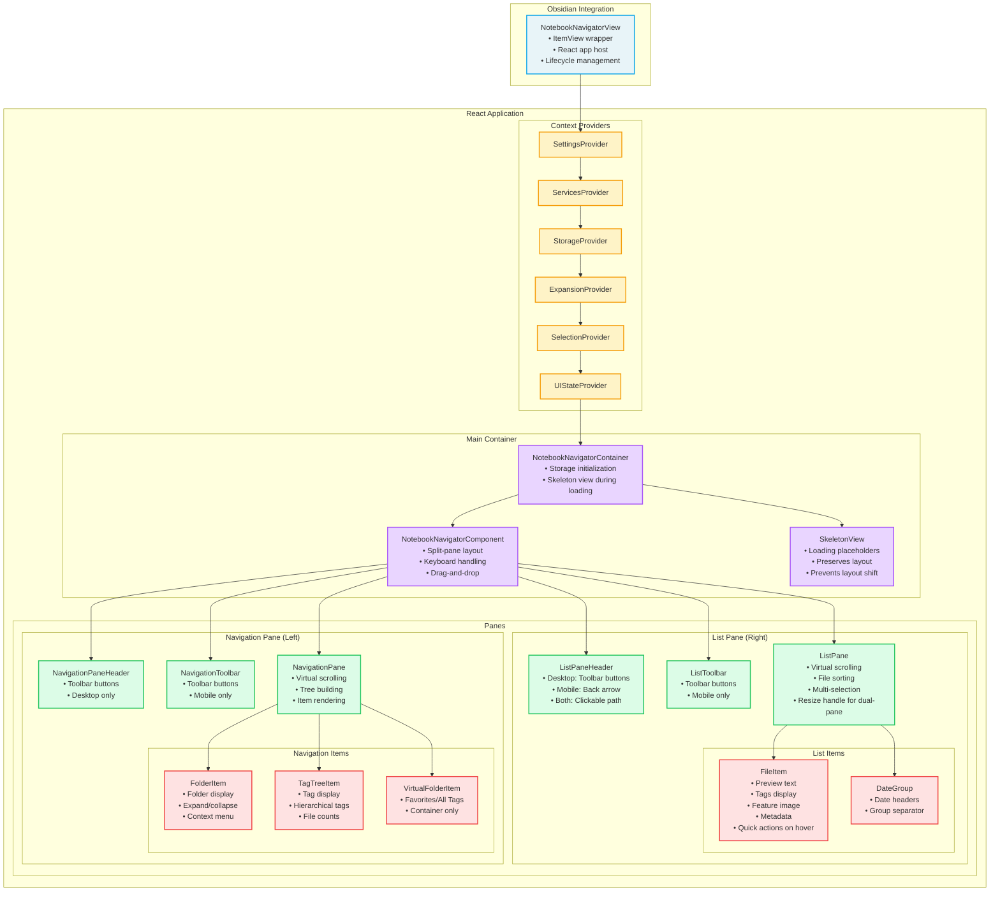
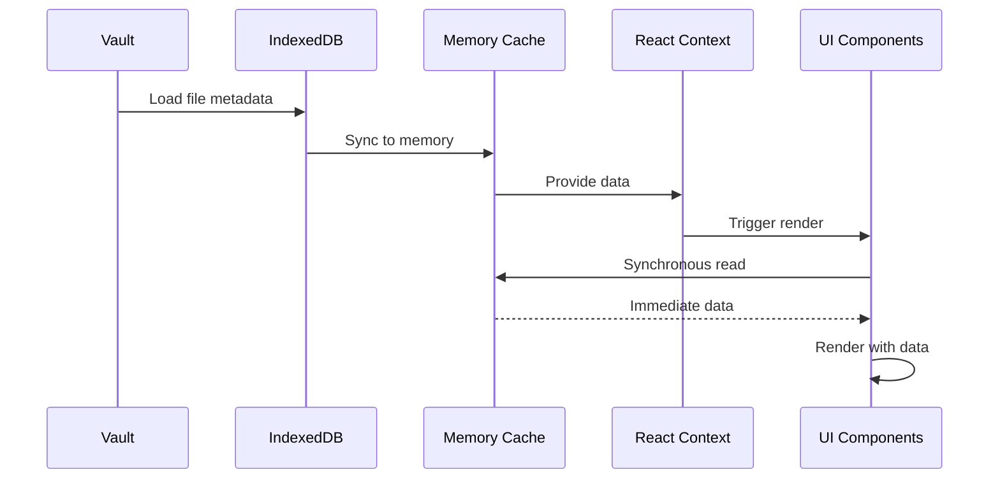
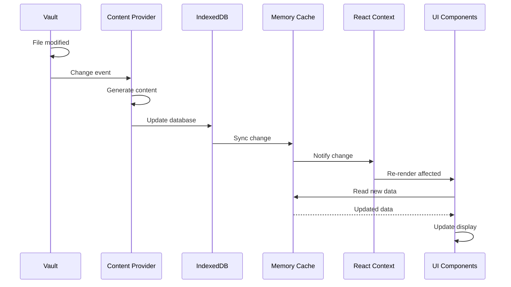
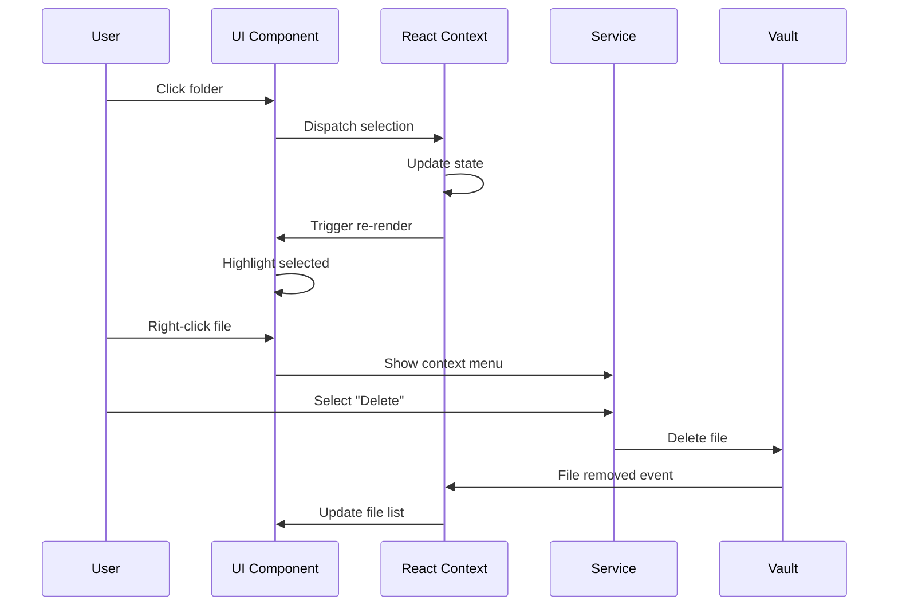

# Notebook Navigator Rendering Architecture

## Table of Contents

- [Overview](#overview)
- [Core Principles](#core-principles)
- [Component Hierarchy](#component-hierarchy)
- [Component Responsibilities](#component-responsibilities)
- [Virtualization Strategy](#virtualization-strategy)
- [Performance Optimizations](#performance-optimizations)
- [Data Flow](#data-flow)
- [Scroll Management System](#scroll-management-system)

## Overview

The Notebook Navigator plugin uses React components with virtual scrolling to handle large vaults. The architecture uses
virtualization, memoization, and synchronous data access patterns for performance.

## Core Principles

### 1. Virtual Scrolling

Both navigation and file list panes use **TanStack Virtual** to render only visible items, enabling smooth performance
with thousands of files and folders.

### 2. Synchronous Data Access

All data needed for rendering is available synchronously from the **Memory Cache**, eliminating layout shifts and
enabling accurate height calculations for virtual scrolling.

### 3. Component Memoization

Every component uses **React.memo** to prevent unnecessary re-renders. Props are carefully designed to be stable
references.

### 4. Context-Based State Management

Six React contexts provide specialized state management:

- **SettingsContext**: User preferences and configuration
- **ServicesContext**: Dependency injection for services
- **StorageContext**: Data management and caching
- **SelectionContext**: Selected folder/tag/file tracking
- **ExpansionContext**: Expanded/collapsed state
- **UIStateContext**: UI-specific state (focus, pane width)

## Component Hierarchy



## Component Responsibilities

### NotebookNavigatorView

**Location**: `src/view/NotebookNavigatorView.tsx`

The Obsidian `ItemView` that hosts the React application:

- Creates and manages the React root
- Handles view lifecycle (onOpen, onClose)
- Provides navigation methods (navigateToFile, navigateToFolderWithModal)
- Manages mobile-specific styles

### NotebookNavigatorContainer

**Location**: `src/components/NotebookNavigatorContainer.tsx`

The wrapper that handles storage initialization:

- Shows SkeletonView while storage is loading
- Loads saved pane width from localStorage
- Transitions to NotebookNavigatorComponent when ready
- Prevents layout shift during initial load

### SkeletonView

**Location**: `src/components/SkeletonView.tsx`

Placeholder UI shown during storage initialization:

- Displays skeleton panes with saved dimensions
- Maintains layout structure (single or dual pane)
- Provides immediate visual feedback
- Smooth transition when data loads

```typescript
// Show skeleton during loading
if (!isStorageReady) {
  return <SkeletonView paneWidth={savedWidth} singlePane={singlePane} />;
}
// Show full UI when ready
return <NotebookNavigatorComponent />;
```

### NotebookNavigatorComponent

**Location**: `src/components/NotebookNavigatorComponent.tsx`

The main container managing the two-pane layout:

- Split-pane with resizable divider
- Global keyboard event handling
- Drag-and-drop coordination
- Focus management between panes
- Command execution (delete, move, create)
- Platform-specific UI rendering (headers vs tab bars)

**Key Features**:

- Resizable panes with persisted widths
- Mobile swipe navigation support
- Keyboard shortcuts for all operations
- File reveal and auto-scroll
- Automatic mobile detection for UI adaptation
- Passes resize handle props to ListPane in dual-pane mode

### NavigationPaneHeader

**Location**: `src/components/NavigationPaneHeader.tsx`

**Desktop only** - The header toolbar for the navigation pane:

- Collapse/expand all folders and tags
- Toggle auto-expand behavior
- Create new folder button

### NavigationToolbar

**Location**: `src/components/NavigationToolbar.tsx`

**Mobile only** - The bottom tab bar for the navigation pane:

- Same toolbar buttons as NavigationPaneHeader
- Positioned at the bottom of the pane
- Mobile-optimized touch targets

### NavigationPane

**Location**: `src/components/NavigationPane.tsx`

The left pane showing folders and tags:

**Responsibilities**:

- Build navigation tree from vault structure
- Virtual scrolling for performance
- Expand/collapse state management
- Search filtering
- Item selection

**Optimization Strategy**:

```typescript
// Tree building with memoization
const navigationItems = useMemo(() => {
  // 1. Build folder tree
  // 2. Filter by search
  // 3. Add virtual folders (Favorites, All Tags)
  // 4. Flatten for virtualizer
  return flattenedItems;
}, [folders, tags, search, expansionState]);

// Virtual scrolling with dynamic heights
const virtualizer = useVirtualizer({
  count: navigationItems.length,
  getScrollElement: () => scrollContainerRef.current,
  estimateSize: index => {
    const item = navigationItems[index];
    return NAVITEM_HEIGHTS[item.type];
  },
  overscan: 10
});
```

### ListPaneHeader

**Location**: `src/components/ListPaneHeader.tsx`

The header for the list pane (visible on both desktop and mobile):

- **Desktop**: Toolbar buttons for subfolders, sort, appearance, new note
- **Mobile**: Back arrow for navigation
- **Both**: Clickable breadcrumb path showing current folder/tag

### ListToolbar

**Location**: `src/components/ListToolbar.tsx`

**Mobile only** - The bottom tab bar for the list pane:

- Toolbar buttons for common operations
- Toggle showing notes from subfolders
- Sort order menu
- Appearance customization menu
- Create new note button

### ListPane

**Location**: `src/components/ListPane.tsx`

The right pane showing files:

**Responsibilities**:

- Display files from selected folder/tag
- Sort files by various criteria
- Group files by date
- Handle pinned notes
- Multi-selection support
- Contains resize handle for pane resizing (dual-pane mode only)

**Dynamic Height Calculation**:

```typescript
// Calculate item height based on content
function estimateSize(index: number): number {
  const item = listItems[index];

  if (item.type === 'date-header') {
    return 30; // Fixed height for date headers
  }

  const file = item as TFile;
  const fileData = memoryCache.get(file.path);

  // Base height
  let height = 80;

  // Add preview text height
  if (settings.showPreview && fileData?.preview) {
    height += settings.previewRows * 20;
  }

  // Add feature image height
  if (settings.showFeatureImage && fileData?.featureImage) {
    height += 200;
  }

  // Add tags height
  if (fileData?.tags?.length) {
    height += 30;
  }

  return height;
}
```

### Item Components

#### NavigationPane: FolderItem

**Location**: `src/components/FolderItem.tsx`

Renders individual folders with:

- Chevron for expand/collapse
- Custom icons and colors
- File count badges
- Folder note indicators
- Context menu integration

#### NavigationPane: TagTreeItem

**Location**: `src/components/TagTreeItem.tsx`

Renders hierarchical tags with:

- Nested tag structure
- File counts (including children)
- Custom icons and colors
- Favorite tag support

#### NavigationPane: VirtualFolderItem

**Location**: `src/components/VirtualFolderItem.tsx`

Renders virtual containers:

- "Favorites" for favorite tags
- "All Tags" for the complete tag tree
- No file operations (purely organizational)

#### ListPane: FileItem

**Location**: `src/components/FileItem.tsx`

Renders file entries with:

- Title with custom names from frontmatter
- Preview text (configurable rows)
- Feature images
- Tag pills
- Date display
- File type badges
- Quick action buttons on hover (desktop only):
  - Reveal in folder
  - Pin/unpin note
  - Open in new tab

#### ListPane: DateGroup

Renders date separators in the file list:

- Groups files by date when grouping is enabled
- Shows relative dates (Today, Yesterday, etc.)
- Visual separator between groups

## Virtualization Strategy

### Navigation Pane Virtualization

The navigation pane uses a single virtualizer for both folders and tags:

```typescript
// Combined items array
type CombinedNavigationItem =
  | { type: 'folder'; item: TFolder; level: number }
  | { type: 'tag'; item: TagTreeNode; level: number }
  | { type: 'virtual'; item: VirtualFolder; level: number };

// Single virtualizer handles all types
const virtualizer = useVirtualizer({
  count: items.length,
  estimateSize: index => getItemHeight(items[index]),
  getScrollElement: () => scrollContainer
});
```

### List Pane Virtualization

The list pane virtualizes files with dynamic heights:

```typescript
// List items include files and date headers
type ListItem = TFile | { type: 'date-header'; date: string };

// Dynamic height based on content
const virtualizer = useVirtualizer({
  count: listItems.length,
  estimateSize: index => calculateHeight(listItems[index]),
  measureElement: el => el.getBoundingClientRect().height
});
```

## Performance Optimizations

### 1. React.memo Everything

Every component is wrapped in `React.memo`:

```typescript
export const FolderItem = React.memo(function FolderItem(props) {
  // Component only re-renders when props change
});
```

### 2. Stable Props

Props are designed to be referentially stable:

```typescript
// BAD - Creates new object every render
<FolderItem style={{ color: folder.color }} />

// GOOD - Passes primitive values
<FolderItem color={folder.color} />
```

### 3. Memoized Callbacks

Event handlers are memoized with `useCallback`:

```typescript
const handleClick = useCallback(() => {
  selectFolder(folder);
}, [folder, selectFolder]);
```

### 4. Synchronous Data Access

All rendering data comes from memory cache:

```typescript
// Synchronous access during render
const fileData = memoryCache.get(file.path);
const preview = fileData?.preview || '';
const tags = fileData?.tags || [];
```

### 5. Deferred Updates

Non-critical updates use `requestIdleCallback`:

```typescript
// Update preview text in background
requestIdleCallback(() => {
  generatePreviewText(file);
});
```

### 6. Batch DOM Updates

Icon rendering uses `useEffect` to avoid blocking:

```typescript
useEffect(() => {
  // Set icons after render to avoid blocking
  setIcon(iconEl.current, 'folder');
}, [isExpanded]);
```

## Data Flow

### Initial Render



### File Change



### User Interaction



## Scroll Orchestration

See the dedicated document: `docs/scroll-orchestration.md`.
