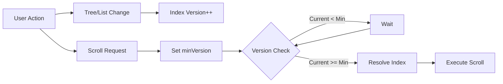
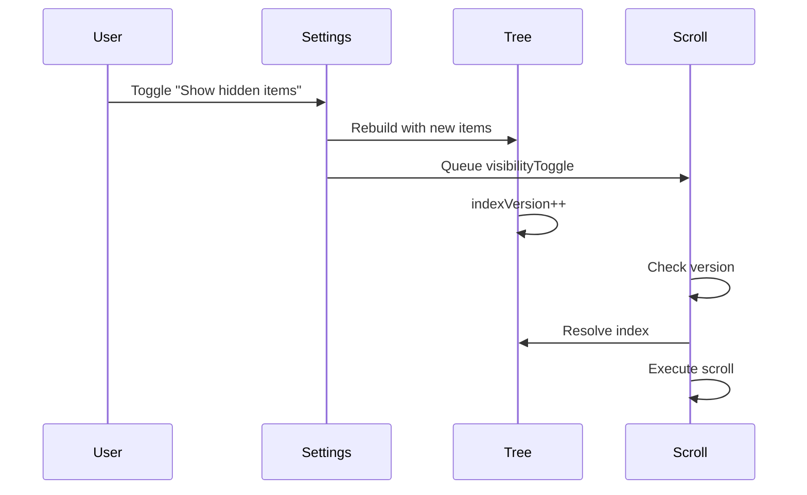
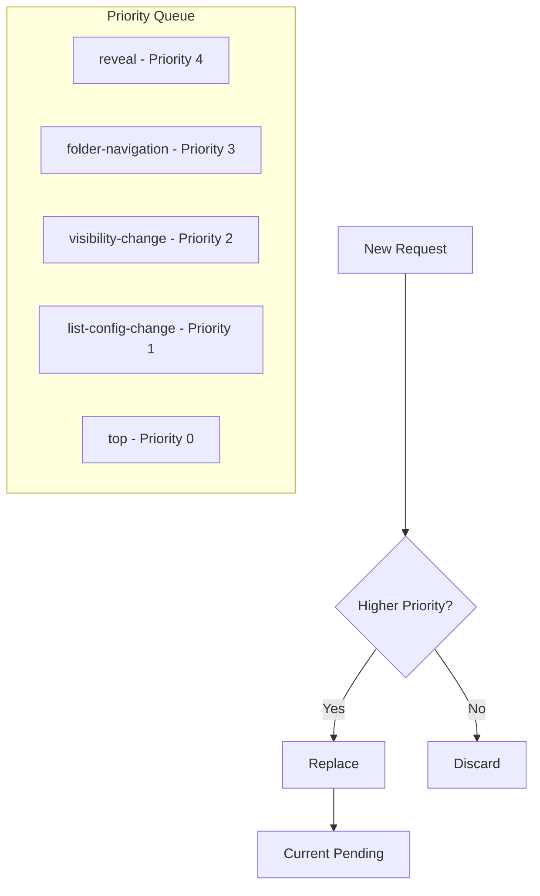

# Notebook Navigator Scroll Orchestration

## Table of Contents

- [Overview](#overview)
- [The Problem](#the-problem)
- [The Solution](#the-solution)
- [Core Concepts](#core-concepts)
  - [Index Versioning](#index-versioning)
  - [Pending Scrolls](#pending-scrolls)
  - [Intent-Based Scrolling](#intent-based-scrolling)
  - [Version Gating](#version-gating)
- [Architecture](#architecture)
  - [Navigation Pane Scrolling](#navigation-pane-scrolling)
  - [List Pane Scrolling](#list-pane-scrolling)
- [Common Scenarios](#common-scenarios)
  - [Toggling Hidden Items](#toggling-hidden-items)
  - [Folder Navigation](#folder-navigation)
  - [Settings Changes](#settings-changes)
  - [Reveal Operations](#reveal-operations)
- [Implementation Details](#implementation-details)
  - [Priority System](#priority-system)
  - [Alignment Policies](#alignment-policies)
  - [Stabilization Mechanism](#stabilization-mechanism)
- [Debugging Guide](#debugging-guide)

## Overview

The scroll orchestration system ensures accurate scrolling when the UI structure changes dynamically. It prevents race
conditions between tree rebuilds and scroll operations through version-based synchronization and intent-driven
execution.

## The Problem

Virtual scrolling in Notebook Navigator faces a critical synchronization challenge:

### Race Condition Example

1. User has tag "todo" selected at index 61
2. User toggles "Show hidden items"
3. Hidden tag "archived" becomes visible at index 40
4. Tree rebuilds, "todo" is now at index 62
5. WITHOUT orchestration: Scroll executes with old index 61 → lands on wrong tag
6. WITH orchestration: Scroll waits for rebuild, uses new index 62 → correct position

This problem occurs in multiple scenarios:

- **Visibility toggles**: Show/hide hidden folders or tags changes indices
- **Settings changes**: Line height, indentation affect virtual list measurements
- **List rebuilds**: Sorting, filtering, subfolder toggles restructure the list
- **Async operations**: Content loads while scrolling is requested

## The Solution

Version-based synchronization with intent-driven scrolling:



Key principles:

1. **Never store indices** - Only store paths, resolve indices at execution time
2. **Version everything** - Track rebuilds with incrementing version numbers
3. **Gate execution** - Scrolls wait for required version before executing
4. **Prioritize intents** - Higher priority scrolls override lower ones

## Core Concepts

### Index Versioning

Each pane maintains an `indexVersion` that increments when its structure changes:

**Navigation Pane triggers:**

- `pathToIndex` Map changes (size or identity)
- Tree structure rebuilds

**List Pane triggers:**

- `filePathToIndex` Map changes
- List item reordering
- Configuration changes

### Pending Scrolls

Scrolls are queued as pending operations with metadata:

```typescript
type PendingScroll = {
  // Navigation Pane
  path?: string; // Target folder/tag path

  // List Pane
  type?: 'file' | 'top'; // Scroll to file or top
  filePath?: string; // Target file path

  // Common
  intent?: ScrollIntent; // Why this scroll was requested
  minIndexVersion?: number; // Minimum version to execute
  align?: 'auto' | 'center'; // Alignment behavior
  createdAt?: string; // Debug timestamp
};
```

### Intent-Based Scrolling

Different scroll reasons have different priorities and behaviors:

**Navigation Pane Intents:**

- `visibilityToggle` - Hidden items toggled (highest priority)
- `selection` - User selected folder/tag
- `reveal` - Show active file command
- `external` - External component request
- `settings-change` - Line height/indentation changed

**List Pane Intents:**

- `reveal` - Show active file (highest priority)
- `folder-navigation` - User changed folders
- `visibility-change` - Mobile drawer opened
- `list-config-change` - Settings changed

### Version Gating

Scrolls only execute when conditions are met:

```typescript
// Set minimum version for deferred execution
if (triggeringRebuild) {
  minIndexVersion = currentVersion + 1; // Wait for next rebuild
} else {
  minIndexVersion = currentVersion; // Execute immediately
}

// Execution check
if (indexVersion >= minIndexVersion) {
  // Safe to execute - structure is ready
  const index = pathToIndex.get(path);
  virtualizer.scrollToIndex(index);
}
```

## Architecture

### Navigation Pane Scrolling

Handles folder and tag tree scrolling with special attention to visibility toggles:



**Critical guard:** Selection effects check for visibility toggles in progress and defer to prevent race conditions.

### List Pane Scrolling

Manages file list scrolling with priority-based queue:



## Common Scenarios

### Toggling Hidden Items

**Problem:** Tag at index 61 moves to index 62 when hidden tag becomes visible.

**Solution:**

1. Detect `showHiddenItems` change
2. Queue `visibilityToggle` scroll with `minIndexVersion = current + 1`
3. Tree rebuilds, incrementing `indexVersion`
4. Scroll executes with correct new index

### Folder Navigation

**Problem:** Selecting a folder should scroll to previously selected file or top.

**Solution:**

1. Detect folder change
2. Queue `folder-navigation` scroll
3. Determine target (selected file or top)
4. Apply mobile-specific centering if needed

### Settings Changes

**Problem:** Changing line height invalidates all virtual measurements.

**Solution:**

1. Detect settings change
2. Re-measure all items
3. Queue scroll to maintain position
4. Use `requestAnimationFrame` for measurement completion

### Reveal Operations

**Problem:** "Reveal active file" must work even during other operations.

**Solution:**

1. Highest priority ensures it overrides other scrolls
2. Expands parent folders/tags as needed
3. Centers the revealed item for visibility

## Implementation Details

### Priority System

List Pane uses explicit priority ranking:

```typescript
const rank = (scroll: PendingScroll) => {
  if (scroll.type === 'top') return 0;
  switch (scroll.reason) {
    case 'list-config-change':
      return 1;
    case 'visibility-change':
      return 2;
    case 'folder-navigation':
      return 3;
    case 'reveal':
      return 4;
  }
};

// Only replace if new has equal or higher priority
if (!current || rank(next) >= rank(current)) {
  pendingScroll = next;
}
```

### Alignment Policies

Different intents use different alignments:

**Navigation Pane:**

- `selection`: `center` on mobile, `auto` on desktop
- `external`: `center`
- mobile reveal (onResize): `auto`
- `visibilityToggle` (show/hide hidden items): `auto`
- collapse/expand operations: pass `align: 'auto'` via `requestScroll`

**List Pane:**

- `folder-navigation`: `center` on mobile, `auto` on desktop
- `reveal`: `auto` - Show if not visible
- `list-config-change`: `auto` - Maintain relative position

### Stabilization Mechanism

Handles rapid consecutive rebuilds:

```typescript
if (intent === 'visibilityToggle') {
  const usedIndex = index;
  requestAnimationFrame(() => {
    const newIndex = pathToIndex.get(path);
    if (newIndex !== usedIndex) {
      // Index changed again - queue follow-up
      queueScroll({
        path,
        intent: 'visibilityToggle',
        minIndexVersion: currentVersion + 1
      });
    }
  });
}
```

## Debugging Guide

### Enable Logging

Both scroll hooks include comprehensive logging (currently commented out in production):

```typescript
console.log(`[NAV_SCROLL] ${timestamp} - Event description`, data);
```

### Common Issues

**Scroll lands on wrong item:**

- Check if `minIndexVersion` is set correctly
- Verify tree rebuild increments `indexVersion`
- Ensure path resolution happens at execution time

**Scroll doesn't execute:**

- Verify pane visibility
- Check version gating conditions
- Ensure pending scroll is set

**Multiple scrolls conflict:**

- Review priority rankings
- Check intent overrides
- Verify guard conditions

### Key Debugging Points

1. **Version increments:** Log when `indexVersion` changes
2. **Path resolution:** Log resolved index vs expected
3. **Execution gates:** Log why scrolls are deferred
4. **Priority decisions:** Log when scrolls are replaced

## See Also

- [Service Architecture](./service-architecture.md) - Overall service structure
- [Startup Process](./startup-process.md) - How data loads initially
- [Storage Architecture](./storage-architecture.md) - How data changes trigger updates
