# Notebook Navigator Service Architecture

## Overview

The service layer provides the business logic that sits between the storage
layer and the UI components. Services encapsulate complex operations, manage
state transitions, and coordinate between different parts of the system. All
services are accessed through dependency injection via the ServicesContext,
ensuring loose coupling and testability.

## Service Hierarchy

```mermaid
graph TB
    subgraph "Core Services"
        MetadataService["MetadataService<br/>Folder/tag/file metadata"]
        FileSystemOperations["FileSystemOperations<br/>File operations & modals"]
        ContentRegistry["ContentProviderRegistry<br/>Content generation"]
    end

    subgraph "Supporting Services"
        TagTreeService["TagTreeService<br/>Tag hierarchy"]
        CommandQueue["CommandQueueService<br/>Operation tracking"]
        IconService["IconService<br/>Icon providers"]
        TagOperations["TagOperations<br/>Tag management"]
    end

    subgraph "Sub-Services"
        FolderMeta["FolderMetadataService"]
        TagMeta["TagMetadataService"]
        FileMeta["FileMetadataService"]
    end

    subgraph "Content Providers"
        PreviewProvider["PreviewContentProvider"]
        ImageProvider["FeatureImageContentProvider"]
        MetadataProvider["MetadataContentProvider"]
        TagProvider["TagContentProvider"]
    end

    MetadataService --> FolderMeta
    MetadataService --> TagMeta
    MetadataService --> FileMeta

    ContentRegistry --> PreviewProvider
    ContentRegistry --> ImageProvider
    ContentRegistry --> MetadataProvider
    ContentRegistry --> TagProvider

    ServicesContext["ServicesContext"] --> MetadataService
    ServicesContext --> FileSystemOperations["FileSystemOperations<br/>File operations & modals"]
    ServicesContext --> ContentRegistry
    ServicesContext --> TagTreeService
    ServicesContext --> CommandQueue
    ServicesContext --> IconService
    ServicesContext --> TagOperations
```



## Core Services

### MetadataService

Central service for managing all metadata operations. Delegates to specialized
sub-services for better organization and separation of concerns.

**Location:** `src/services/MetadataService.ts`

**Responsibilities:**

- Folder metadata (colors, icons, sort overrides, appearances)
- Tag metadata (colors, icons, sort overrides, appearances)
- File metadata (pinned notes)
- Metadata cleanup during startup
- Rename operations coordination

**Sub-Services:**

- **FolderMetadataService** (`src/services/metadata/FolderMetadataService.ts`)
  - Manages folder colors, icons, custom sort orders, and appearance settings
  - Handles folder rename metadata updates
  - Persists data in plugin settings

- **TagMetadataService** (`src/services/metadata/TagMetadataService.ts`)
  - Manages tag colors, icons, custom sort orders, and appearance settings
  - Handles tag rename metadata updates
  - Persists data in plugin settings

- **FileMetadataService** (`src/services/metadata/FileMetadataService.ts`)
  - Manages pinned notes for folders and tags
  - Handles file rename and move operations
  - Maintains pin order and persistence

**Key Methods:**

```typescript
// Folder operations
setFolderColor(folderPath: string, color: string): Promise<void>
setFolderIcon(folderPath: string, iconId: string): Promise<void>
setFolderSortOverride(folderPath: string, sortOption: SortOption): Promise<void>

// Tag operations
setTagColor(tagPath: string, color: string): Promise<void>
setTagIcon(tagPath: string, iconId: string): Promise<void>
setTagSortOverride(tagPath: string, sortOption: SortOption): Promise<void>

// File operations
togglePinForFolder(filePath: string, folderPath: string): Promise<void>
togglePinForTag(filePath: string, tagPath: string): Promise<void>
isPinnedInFolder(filePath: string, folderPath: string): boolean

// Cleanup operations
performUnifiedCleanup(validators: CleanupValidators): Promise<CleanupResult>
```

### FileSystemOperations

Handles all file system operations with user interaction through modals and
confirmations.

**Location:** `src/services/FileSystemService.ts`

**Responsibilities:**

- File creation, deletion, and renaming
- Folder creation, deletion, and renaming
- Folder note management
- Move operations with conflict resolution
- Modal dialogs for user input
- Smart selection updates after operations

**Key Methods:**

```typescript
createNewNote(folder: TFolder, suggestedName?: string): Promise<TFile | null>
createNewFolder(parentFolder: TFolder): Promise<TFolder | null>
renameFile(file: TAbstractFile): Promise<void>
deleteFiles(files: TAbstractFile[], settings: NotebookNavigatorSettings): Promise<void>
moveFilesToFolder(options: MoveFilesOptions): Promise<MoveFilesResult>
createFolderNote(folder: TFolder): Promise<TFile | null>
deleteFolderNote(folder: TFolder): Promise<void>
```

### ContentProviderRegistry

Manages the registration and coordination of content providers for background
content generation.

**Location:** `src/services/content/ContentProviderRegistry.ts`

**Responsibilities:**

- Provider registration and lifecycle
- Settings change coordination
- Batch content generation
- Content clearing on settings changes

**Content Providers:**

- **PreviewContentProvider** (`src/services/content/PreviewContentProvider.ts`)
  - Generates preview text from note content
  - Respects heading skip settings
  - Handles unicode and length limits
  - Supports configurable preview length

- **FeatureImageContentProvider**
  (`src/services/content/FeatureImageContentProvider.ts`)
  - Extracts feature images from frontmatter properties
  - Falls back to first embedded image in content
  - Supports multiple image property names
  - Validates image file existence

- **MetadataContentProvider**
  (`src/services/content/MetadataContentProvider.ts`)
  - Extracts custom frontmatter fields
  - Handles name field overrides
  - Processes created/modified timestamp fields
  - Parses timestamps with configurable formats

- **TagContentProvider** (`src/services/content/TagContentProvider.ts`)
  - Extracts tags from both frontmatter and document text
  - Uses Obsidian's getAllTags for comprehensive tag extraction
  - Deduplicates tags with different casing
  - Preserves original tag casing

**Provider Interface:**

```typescript
interface IContentProvider {
  getContentType(): ContentType;
  getRelevantSettings(): (keyof NotebookNavigatorSettings)[];
  shouldRegenerate(oldSettings, newSettings): boolean;
  clearContent(): Promise<void>;
  queueFiles(files: TFile[], settings): void;
  onSettingsChanged(settings): void;
}
```

## Supporting Services

### TagTreeService

Bridge between React components and the tag tree data structure.

**Location:** `src/services/TagTreeService.ts`

**Responsibilities:**

- Tag tree data access
- Favorite tags management
- Untagged count tracking
- Tag node lookup
- Tag path collection

**Key Methods:**

```typescript
updateTagTree(tree: Map<string, TagTreeNode>, untagged: number): void
getTagTree(): Map<string, TagTreeNode>
findTagNode(tagPath: string): TagTreeNode | null
getAllTagPaths(): string[]
getUntaggedCount(): number
```

### CommandQueueService

Manages operation context and tracking, replacing global window flags.

**Location:** `src/services/CommandQueueService.ts`

**Responsibilities:**

- Operation queueing and execution
- Context preservation during operations
- File move tracking
- Folder note open tracking
- Version history operations

**Operation Types:**

```typescript
enum OperationType {
  MOVE_FILE = 'move-file',
  OPEN_FOLDER_NOTE = 'open-folder-note',
  OPEN_VERSION_HISTORY = 'open-version-history'
}
```

### IconService

Singleton service managing icon providers and rendering.

**Location:** `src/services/icons/IconService.ts`

**Responsibilities:**

- Provider registration (Lucide, Emoji)
- Icon ID parsing with prefixes
- Recent icons tracking
- Cross-provider search
- Icon rendering coordination

**Icon Providers:**

- **LucideIconProvider** - Obsidian's built-in Lucide icons
- **EmojiIconProvider** - Unicode emoji support

**Key Methods:**

```typescript
registerProvider(provider: IconProvider): void
parseIconId(iconId: string): ParsedIconId
renderIcon(iconId: string, containerEl: HTMLElement): void
searchIcons(query: string): IconDefinition[]
getRecentIcons(): string[]
```

### TagOperations

Manages tag operations on files through frontmatter manipulation.

**Location:** `src/services/TagOperations.ts`

**Responsibilities:**

- Adding tags to files
- Removing specific tags
- Clearing all tags
- Tag hierarchy management
- Case-insensitive tag handling

**Key Methods:**

```typescript
addTagToFiles(tag: string, files: TFile[]): Promise<{added: number, skipped: number}>
removeTagFromFiles(tag: string, files: TFile[]): Promise<{removed: number, skipped: number}>
removeAllTagsFromFiles(files: TFile[]): Promise<{removed: number}>
getTagsFromFiles(files: TFile[]): string[]
fileHasTagOrAncestor(file: TFile, tag: string): Promise<boolean>
```

## Dependency Injection

Services use dependency injection through interfaces to reduce coupling:

### ISettingsProvider

**Location:** `src/interfaces/ISettingsProvider.ts`

Provides access to plugin settings without direct plugin dependency:

```typescript
interface ISettingsProvider {
  readonly settings: NotebookNavigatorSettings;
  saveSettings(): Promise<void>;
}
```

### ITagTreeProvider

**Location:** `src/interfaces/ITagTreeProvider.ts`

Provides access to tag tree data without React context dependency:

```typescript
interface ITagTreeProvider {
  getTagTree(): Map<string, TagTreeNode>;
  findTagNode(tagPath: string): TagTreeNode | null;
  getAllTagPaths(): string[];
}
```

### IContentProvider

**Location:** `src/interfaces/IContentProvider.ts`

Defines the contract for content generation providers:

```typescript
interface IContentProvider {
  getContentType(): ContentType;
  getRelevantSettings(): (keyof NotebookNavigatorSettings)[];
  shouldRegenerate(oldSettings, newSettings): boolean;
  clearContent(): Promise<void>;
}
```

## Service Initialization

Services are instantiated during plugin startup (see startup-process.md Phase
1):

**In Plugin.onload()** - Core services initialized immediately:

```typescript
// Initialize core services
this.fileSystemOps = new FileSystemOperations(this.app, this.settings);
this.metadataService = new MetadataService(
  this.app,
  this,
  () => this.tagTreeService
);
this.tagOperations = new TagOperations(this.app);
this.tagTreeService = new TagTreeService();
this.commandQueue = new CommandQueueService(this.app);

// Icon service is a singleton
const iconService = IconService.getInstance();
iconService.registerProvider(new LucideIconProvider());
iconService.registerProvider(new EmojiIconProvider());
```

**In React mount** - Services provided through context:

```typescript
// ServicesContext provides dependency injection
<ServicesProvider plugin={plugin}>
  <StorageProvider>
    {/* Services accessible via useServices() hook */}
  </StorageProvider>
</ServicesProvider>
```

**Content providers** - Initialized in StorageContext:

```typescript
// ContentProviderRegistry initialized during storage setup
const registry = new ContentProviderRegistry();
registry.registerProvider(new PreviewContentProvider(app));
registry.registerProvider(new FeatureImageContentProvider(app));
registry.registerProvider(new MetadataContentProvider(app));
registry.registerProvider(new TagContentProvider(app));
```

## Data Flow

### Content Generation Flow

Background content generation follows this process (see startup-process.md Phase
5):

1. **File Detection**: Each provider checks if files need processing
   - Null content fields indicate initial generation needed
   - Modified time (mtime) differences trigger regeneration
   - Settings changes may clear content for regeneration

2. **Queue Management**: `ContentProviderRegistry` manages the queue
   - Files queued based on enabled settings
   - Processes files in batches (100 files per batch)
   - Uses requestIdleCallback for non-blocking processing
   - Parallel processing limit of 10 files

3. **Processing**: Each provider processes files independently
   - TagContentProvider: Uses `app.metadataCache.getFileCache()`
   - PreviewContentProvider: Uses `app.vault.cachedRead()`
   - FeatureImageContentProvider: Checks frontmatter then embedded images
   - MetadataContentProvider: Extracts custom frontmatter fields

4. **Database Updates**: Results stored in IndexedDB
   - Each provider returns updates to IndexedDBStorage
   - Database fires content change events

5. **Memory Sync**: `MemoryFileCache` automatically synced with IndexedDB

6. **UI Updates**: `StorageContext` listens for database changes
   - Tag changes trigger tag tree rebuild
   - Components re-render via React context

### Metadata Cleanup Flow

Cleanup runs after initial load to remove orphaned metadata:

1. **Validator Preparation**: `MetadataService.prepareCleanupValidators()`
   - Collects all vault files and folders
   - Builds tag tree from extracted tags
   - Creates validator data structures

2. **Cleanup Operations**: `MetadataService.runUnifiedCleanup()`
   - Validates folder metadata against vault folders
   - Validates pinned notes against vault files
   - Validates tag metadata against tag tree
   - Removes orphaned entries

3. **Settings Persistence**: Updated settings saved to `data.json`

### File Operation Flow

1. User initiates file operation (create, rename, delete, move)
2. `FileSystemOperations` shows modal for user input if needed
3. Operation is tracked by `CommandQueueService`
4. Vault operation is performed
5. Selection is updated intelligently
6. Storage layer is notified of changes
7. UI updates reflect new file structure

## Service Patterns

### Singleton Pattern

- **IconService** - Ensures single instance across plugin

### Provider Pattern

- **ContentProviders** - Pluggable content generation
- **IconProviders** - Extensible icon support

### Delegation Pattern

- **MetadataService** - Delegates to specialized sub-services

### Bridge Pattern

- **TagTreeService** - Bridges React and non-React code

### Command Pattern

- **CommandQueueService** - Encapsulates operations as objects
