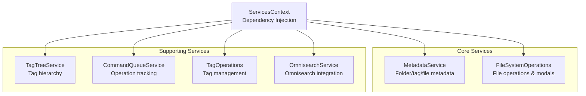

# Notebook Navigator Service Architecture

## Table of Contents

- [Overview](#overview)
- [Service Hierarchy](#service-hierarchy)
- [Core Services](#core-services)
- [Supporting Services](#supporting-services)
- [Dependency Injection](#dependency-injection)
- [Service Initialization](#service-initialization)
- [Data Flow](#data-flow)
- [Service Patterns](#service-patterns)

## Overview

The service layer provides the business logic that sits between the storage layer and the UI components. Services
encapsulate complex operations, manage state transitions, and coordinate between different parts of the system. All
services are accessed through dependency injection via the ServicesContext, ensuring loose coupling and testability.

ServicesContext currently exposes the plugin instance, Obsidian app, and these singleton services:

- FileSystemOperations (file and folder actions)
- MetadataService (folder/tag/file metadata)
- TagTreeService (tag tree state)
- TagOperations (frontmatter tag mutations)
- CommandQueueService (operation tracking)
- OmnisearchService (optional search integration)

IconService remains a plugin-level singleton accessed through `getIconService()`, and the content generation pipeline is
constructed inside `StorageContext` via `ContentProviderRegistry` rather than being part of the dependency injection
container.

## Service Hierarchy

### Service Context and Main Services



### Metadata Service Structure


### Content Provider Registry Structure


`ContentProviderRegistry` is owned by `StorageContext`. The registry and its providers are created when storage mounts
and are not exposed through `ServicesContext`.

## Core Services

### MetadataService

Central service for managing all metadata operations. Delegates to specialized sub-services for better organization and
separation of concerns.

**Location:** `src/services/MetadataService.ts`

**Responsibilities:**

- Folder metadata (colors, icons, sort overrides, appearances)
- Tag metadata (colors, icons, sort overrides, appearances)
- File metadata (pinned notes)
- Metadata cleanup (manual trigger from settings only)
- Rename operations coordination

**Sub-Services:**

- **FolderMetadataService** (`src/services/metadata/FolderMetadataService.ts`)
  - Manages folder colors, icons, custom sort orders, and appearance settings
  - Handles folder rename metadata updates
  - Persists data in plugin settings

- **TagMetadataService** (`src/services/metadata/TagMetadataService.ts`)
  - Manages tag colors, icons, custom sort orders, and appearance settings
  - Handles tag rename metadata updates
  - Persists data in plugin settings

- **FileMetadataService** (`src/services/metadata/FileMetadataService.ts`)
  - Manages pinned notes for folders and tags
  - Handles file rename and move operations
  - Maintains pin order and persistence

**Key Methods:**

```typescript
// Folder operations
setFolderColor(folderPath: string, color: string): Promise<void>
removeFolderColor(folderPath: string): Promise<void>
setFolderIcon(folderPath: string, iconId: string): Promise<void>
removeFolderIcon(folderPath: string): Promise<void>
setFolderSortOverride(folderPath: string, sortOption: SortOption): Promise<void>
removeFolderSortOverride(folderPath: string): Promise<void>
handleFolderRename(oldPath: string, newPath: string): Promise<void>
handleFolderDelete(folderPath: string): Promise<void>

// Tag operations
setTagColor(tagPath: string, color: string): Promise<void>
removeTagColor(tagPath: string): Promise<void>
setTagIcon(tagPath: string, iconId: string): Promise<void>
removeTagIcon(tagPath: string): Promise<void>
setTagSortOverride(tagPath: string, sortOption: SortOption): Promise<void>
removeTagSortOverride(tagPath: string): Promise<void>

// File pin operations
togglePinnedNote(filePath: string, context: NavigatorContext): Promise<void>
isFilePinned(filePath: string, context?: NavigatorContext): boolean
getPinnedNotes(context?: NavigatorContext): string[]
handleFileDelete(filePath: string): Promise<void>
handleFileRename(oldPath: string, newPath: string): Promise<void>

// Cleanup operations (for external file changes)
cleanupAllMetadata(): Promise<boolean>  // Manual trigger from settings
cleanupTagMetadata(): Promise<boolean>
cleanupFolderMetadata(): Promise<boolean>
cleanupPinnedNotes(): Promise<boolean>
runUnifiedCleanup(validators: CleanupValidators): Promise<boolean>
getCleanupSummary(): Promise<MetadataCleanupSummary>
static prepareCleanupValidators(app: App, tagTree: Map<string, TagTreeNode>): CleanupValidators
```

### FileSystemOperations

Handles all file system operations with user interaction through modals and confirmations.

**Location:** `src/services/FileSystemService.ts`

**Responsibilities:**

- File creation, deletion, and renaming
- Folder creation, deletion, and renaming
- Folder note management
- Move operations with conflict resolution
- Modal dialogs for user input
- Smart selection updates after operations

**Key Methods:**

```typescript
// File operations
createNewFile(parent: TFolder): Promise<TFile | null>
renameFile(file: TFile, settings?: NotebookNavigatorSettings): Promise<void>
deleteFile(file: TFile, confirmBeforeDelete: boolean, onSuccess?: () => void, preDeleteAction?: () => Promise<void>): Promise<void>
deleteSelectedFile(): Promise<void>  // Smart deletion with selection update
duplicateNote(file: TFile): Promise<void>

// Folder operations
createNewFolder(parent: TFolder, onSuccess?: (path: string) => void): Promise<void>
renameFolder(folder: TFolder, settings?: NotebookNavigatorSettings): Promise<void>
deleteFolder(folder: TFolder, confirmBeforeDelete: boolean, onSuccess?: () => void): Promise<void>
duplicateFolder(folder: TFolder): Promise<void>

// Folder note operations
createFolderNote(folder: TFolder): Promise<TFile | null>
deleteFolderNote(folder: TFolder): Promise<void>

// Multi-file operations
moveFilesWithModal(files: TFile[], targetFolder: TFolder, onSuccess?: () => void): Promise<void>
deleteMultipleFiles(files: TAbstractFile[], confirmBeforeDelete: boolean, onSuccess?: () => void): Promise<void>
deleteFilesWithSmartSelection(files: TAbstractFile[], confirmBeforeDelete: boolean): Promise<void>

// Special file types
createCanvas(parent: TFolder): Promise<TFile | null>
createBase(parent: TFolder): Promise<TFile | null>
createNewDrawing(parent: TFolder): Promise<TFile | null>

// System operations
openVersionHistory(file: TFile): Promise<void>
revealInSystemExplorer(file: TFile | TFolder): Promise<void>
getRevealInSystemExplorerText(): string

// Utility methods
isDescendant(parent: TAbstractFile, child: TAbstractFile): boolean
```

### ContentProviderRegistry

Manages the registration and coordination of content providers for background content generation. StorageContext creates
and owns the registry during mount; consumers interact with content through StorageContext rather than via
ServicesContext.

**Location:** `src/services/content/ContentProviderRegistry.ts`

**Responsibilities:**

- Provider registration and lifecycle
- Settings change coordination
- Batch content generation
- Content clearing on settings changes

**Content Providers:**

- **PreviewContentProvider** (`src/services/content/PreviewContentProvider.ts`)
  - Generates preview text from note content
  - Respects heading skip settings
  - Handles unicode and length limits
  - Supports configurable preview length

- **FeatureImageContentProvider** (`src/services/content/FeatureImageContentProvider.ts`)
  - Extracts feature images from frontmatter properties
  - Falls back to first embedded image in content
  - Supports multiple image property names
  - Validates image file existence

- **MetadataContentProvider** (`src/services/content/MetadataContentProvider.ts`)
  - Extracts custom frontmatter fields
  - Handles name field overrides
  - Processes created/modified timestamp fields
  - Parses timestamps with configurable formats

- **TagContentProvider** (`src/services/content/TagContentProvider.ts`)
  - Extracts tags from both frontmatter and document text
  - Uses Obsidian's getAllTags for comprehensive tag extraction
  - Deduplicates tags with different casing
  - Preserves original tag casing

**Provider Interface:**

```typescript
interface IContentProvider {
  getContentType(): ContentType;
  getRelevantSettings(): (keyof NotebookNavigatorSettings)[];
  shouldRegenerate(oldSettings, newSettings): boolean;
  clearContent(): Promise<void>;
  queueFiles(files: TFile[]): void; // No settings parameter
  startProcessing(settings: NotebookNavigatorSettings): void;
  stopProcessing(): void;
  onSettingsChanged(settings): void;
}
```

**Registry Methods:**

```typescript
registerProvider(provider: IContentProvider): void
getProvider(type: ContentType): IContentProvider | undefined
getAllProviders(): IContentProvider[]
getAllRelevantSettings(): (keyof NotebookNavigatorSettings)[]
queueFilesForAllProviders(files: TFile[], settings: NotebookNavigatorSettings): void
handleSettingsChange(oldSettings, newSettings): void
stopAllProcessing(): void
```

## Supporting Services

### TagTreeService

Bridge between React components and the tag tree data structure.

**Location:** `src/services/TagTreeService.ts`

**Responsibilities:**

- Tag tree data access
- Favorite tags management
- Untagged count tracking
- Tag node lookup
- Tag path collection

**Key Methods:**

```typescript
updateTagTree(tree: Map<string, TagTreeNode>, untagged: number, favoriteTree?: Map<string, TagTreeNode>): void
getTagTree(): Map<string, TagTreeNode>
findTagNode(tagPath: string): TagTreeNode | null
getAllTagPaths(): string[]
getUntaggedCount(): number
collectTagPaths(node: TagTreeNode): Set<string>
```

### CommandQueueService

Manages operation context and tracking, replacing global window flags.

**Location:** `src/services/CommandQueueService.ts`

**Responsibilities:**

- Operation queueing and execution
- Context preservation during operations
- File move tracking
- File delete tracking
- Folder note open tracking
- Version history operations
- New context (tab/split/window) tracking

**Operation types:**

```typescript
enum OperationType {
  MOVE_FILE = 'move-file',
  DELETE_FILES = 'delete-files',
  OPEN_FOLDER_NOTE = 'open-folder-note',
  OPEN_VERSION_HISTORY = 'open-version-history',
  OPEN_IN_NEW_CONTEXT = 'open-in-new-context'
}
```

**Key methods:**

```typescript
// Check operation status
isMovingFile(): boolean
isDeletingFiles(): boolean
isOpeningFolderNote(): boolean
isOpeningVersionHistory(): boolean
isOpeningInNewContext(): boolean  // Only for tab/split, not window

// Execute operations with tracking
executeMoveFiles(files: TFile[], targetFolder: TFolder): Promise<CommandResult>
executeDeleteFiles(files: TFile[], performDelete: () => Promise<void>): Promise<CommandResult>
executeOpenFolderNote(folderPath: string, openFile: () => Promise<void>): Promise<CommandResult>
executeOpenVersionHistory(file: TFile, openHistory: () => Promise<void>): Promise<CommandResult>
executeOpenInNewContext(file: TFile, context: PaneType, openFile: () => Promise<void>): Promise<CommandResult>

// Subscribe to operation activity changes
onOperationChange(listener: (type: OperationType, active: boolean) => void): () => void

// Debug and maintenance
getActiveOperations(): Operation[]
clearAllOperations(): void
```

**Implementation Details:**

- **Operation Tracking**: Each operation is assigned a unique ID and tracked in an internal Map
- **Automatic Cleanup**: Operations are automatically removed after completion or error
- **Context Awareness**: The `isOpeningInNewContext()` method only returns true for tab/split operations, not window
  operations (since window opens don't affect the current window's focus)
- **Command Results**: All execute methods return a `CommandResult` interface:
  ```typescript
  interface CommandResult<T = unknown> {
    success: boolean;
    data?: T; // Operation-specific data (e.g., move counts)
    error?: Error;
  }
  ```
- **Move operation results**: returns `{ movedCount: number; skippedCount: number }` for file move operations

**Batch UI update pattern:**

- The file list suppresses intermediate refreshes during batch operations.
- `useListPaneData` defers handling of `vault.create`, `vault.delete`, and `vault.rename` while `MOVE_FILE` or
  `DELETE_FILES` are active.
- After the operation ends, it flushes a single refresh after `TIMEOUTS.FILE_OPERATION_DELAY`.
- Subscription example:

```typescript
// useListPaneData
const unsubscribe = commandQueue.onOperationChange((type, active) => {
  if (type === OperationType.MOVE_FILE || type === OperationType.DELETE_FILES) {
    operationActiveRef.current = active;
    if (!active) {
      flushPendingWhenIdle(); // schedules one update after TIMEOUTS.FILE_OPERATION_DELAY
    }
  }
});
```

**Delete integration:**

- `FileSystemOperations.deleteFile` and `deleteMultipleFiles` wrap deletes with `executeDeleteFiles`.
- This aligns delete behavior with move behavior for list updates.

### IconService

Singleton service managing icon providers and rendering. IconService is not part of `ServicesContext`; consumers access
it via `getIconService()` from `src/services/icons`.

**Location:** `src/services/icons/IconService.ts`

**Responsibilities:**

- Provider registration (built-in and external)
- Icon ID parsing with prefixes
- Recent icons tracking
- Cross-provider search
- Icon rendering coordination
- External icon pack management

**Built-in Icon Providers:**

- **LucideIconProvider** - Obsidian's built-in Lucide icons
- **EmojiIconProvider** - Unicode emoji support

**Downloadable Icon Packs:**

External icon packs can be downloaded and managed through settings:

- **BootstrapIconProvider** - Bootstrap Icons (1,800+ icons)
- **FontAwesomeIconProvider** - Font Awesome Free (2,000+ icons)
- **MaterialIconProvider** - Material Icons (2,100+ icons)
- **PhosphorIconProvider** - Phosphor Icons (7,000+ icons)
- **RpgAwesomeIconProvider** - RPG Awesome (500+ game/fantasy icons)

**Icon Pack Architecture:**

- **ExternalIconProviderController** (`src/services/icons/external/ExternalIconProviderController.ts`)
  - Manages download, installation, and removal of icon packs
  - Handles version management and updates
  - Coordinates with IconAssetDatabase for storage

- **IconAssetDatabase** (`src/services/icons/external/IconAssetDatabase.ts`)
  - IndexedDB-based storage for icon pack assets (fonts, CSS, manifests)
  - Device-local storage (not synced across devices)
  - Automatic cleanup and version management
  - Database name: `notebooknavigator/icon-assets/{appId}`

**Key Methods:**

```typescript
// Provider management
registerProvider(provider: IconProvider): void
unregisterProvider(providerId: string): void
getProvider(providerId: string): IconProvider | undefined
getAllProviders(): IconProvider[]

// Icon operations
parseIconId(iconId: string): ParsedIconId
renderIcon(container: HTMLElement, iconId: string, size?: number): void  // Note: parameter order
formatIconId(provider: string, identifier: string): string
isValidIcon(iconId: string): boolean

// Icon search and retrieval
search(query: string, providerId?: string): IconDefinition[]
getAllIcons(providerId?: string): IconDefinition[]
getRecentIcons(): string[]
```

### TagOperations

Manages tag operations on files through frontmatter manipulation.

**Location:** `src/services/TagOperations.ts`

**Responsibilities:**

- Adding tags to files
- Removing specific tags
- Clearing all tags
- Tag hierarchy management
- Case-insensitive tag handling

**Key Methods:**

```typescript
addTagToFiles(tag: string, files: TFile[]): Promise<{added: number, skipped: number}>
removeTagFromFiles(tag: string, files: TFile[]): Promise<number>  // Returns removed count only
clearAllTagsFromFiles(files: TFile[]): Promise<number>  // Different method name, returns count
getTagsFromFiles(files: TFile[]): string[]
// Note: fileHasTagOrAncestor is a private method, not part of public API
```

### OmnisearchService

Wraps the community Omnisearch plugin and exposes optional full-text search features.

**Location:** `src/services/OmnisearchService.ts`

**Responsibilities:**

- Detect Omnisearch availability
- Execute full-text searches when the plugin is installed
- Translate raw Omnisearch results into `OmnisearchHit`
- Register and unregister indexing callbacks for reactive updates

**Key Methods:**

```typescript
isAvailable(): boolean
search(query: string): Promise<OmnisearchHit[]>
registerOnIndexed(callback: () => void): void
unregisterOnIndexed(callback: () => void): void
```

## Dependency Injection

Services use dependency injection through interfaces to reduce coupling:

### ISettingsProvider

**Location:** `src/interfaces/ISettingsProvider.ts`

Provides access to plugin settings without direct plugin dependency:

```typescript
interface ISettingsProvider {
  readonly settings: NotebookNavigatorSettings;
  saveSettings(): Promise<void>;
}
```

### ITagTreeProvider

**Location:** `src/interfaces/ITagTreeProvider.ts`

Provides access to tag tree data without React context dependency:

```typescript
interface ITagTreeProvider {
  getTagTree(): Map<string, TagTreeNode>;
  findTagNode(tagPath: string): TagTreeNode | null;
  getAllTagPaths(): string[];
}
```

### IContentProvider

**Location:** `src/interfaces/IContentProvider.ts`

Defines the contract for content generation providers:

```typescript
interface IContentProvider {
  getContentType(): ContentType;
  getRelevantSettings(): (keyof NotebookNavigatorSettings)[];
  shouldRegenerate(oldSettings, newSettings): boolean;
  clearContent(): Promise<void>;
}
```

## Service Initialization

Services are instantiated during plugin startup (see startup-process.md Phase 1):

**In Plugin.onload()** - Core services initialized immediately:

```typescript
// Initialize core services
this.metadataService = new MetadataService(this.app, this, () => this.tagTreeService);
this.tagOperations = new TagOperations(this.app);
this.tagTreeService = new TagTreeService();
this.commandQueue = new CommandQueueService(this.app);
this.fileSystemOps = new FileSystemOperations(
  this.app,
  () => this.tagTreeService,
  () => this.commandQueue
);
this.omnisearchService = new OmnisearchService(this.app);

const iconService = getIconService();
this.externalIconController = new ExternalIconProviderController(this.app, iconService, this);
await this.externalIconController.initialize();
void this.externalIconController.syncWithSettings();
```

**In React mount** - Services provided through context:

```typescript
// ServicesContext provides dependency injection
<ServicesProvider plugin={plugin}>
  <StorageProvider>
    {/* Services accessible via useServices() hook */}
  </StorageProvider>
</ServicesProvider>
```

**Content providers** - Initialized in StorageContext:

```typescript
// ContentProviderRegistry initialized during storage setup
const registry = new ContentProviderRegistry();
registry.registerProvider(new PreviewContentProvider(app));
registry.registerProvider(new FeatureImageContentProvider(app));
registry.registerProvider(new MetadataContentProvider(app));
registry.registerProvider(new TagContentProvider(app));
```

## Data Flow

### Content Generation Flow

Background content generation follows this process (see startup-process.md Phase 5):

1. **File Detection**: Each provider checks if files need processing
   - Null content fields indicate initial generation needed
   - Modified time (mtime) differences trigger regeneration
   - Settings changes may clear content for regeneration

2. **Queue Management**: `ContentProviderRegistry` manages the queue
   - Files queued based on enabled settings
   - Processes files in batches (100 files per batch)
   - Uses deferred scheduling for non-blocking processing
   - Parallel processing limit of 10 files

3. **Processing**: Each provider processes files independently
   - TagContentProvider: Uses `app.metadataCache.getFileCache()`
   - PreviewContentProvider: Uses `app.vault.cachedRead()`
   - FeatureImageContentProvider: Checks frontmatter then embedded images
   - MetadataContentProvider: Extracts custom frontmatter fields

4. **Database Updates**: Results stored in IndexedDB
   - Each provider returns updates to IndexedDBStorage
   - Database fires content change events

5. **Memory Sync**: `MemoryFileCache` automatically synced with IndexedDB

6. **UI Updates**: `StorageContext` listens for database changes
   - Tag changes trigger tag tree rebuild
   - Components re-render via React context

### Metadata Cleanup Flow

Metadata cleanup is **manually triggered** from settings.

**When cleanup is needed:**

- Files/folders renamed or deleted outside of Obsidian
- Files/folders renamed or deleted while the plugin was disabled
- Sync conflicts resulted in orphaned metadata

**Manual Trigger**: Settings → Notebook Navigator → Advanced → "Clean up metadata" button

1. **Validator Preparation**: `MetadataService.prepareCleanupValidators()`
   - Collects all vault files and folders
   - Builds tag tree from current tags
   - Creates validator data structures

2. **Cleanup Operations**: `MetadataService.runUnifiedCleanup()`
   - Validates folder metadata against vault folders
   - Validates pinned notes against vault files
   - Validates tag metadata against tag tree
   - Removes orphaned entries
   - Returns cleanup results with counts of removed items

3. **Settings Persistence**: Updated settings saved to `data.json`

4. **User Feedback**: Shows notice with cleanup results (e.g., "Cleaned up 3 folders, 5 tags")

### File Operation Flow

1. User initiates file operation (create, rename, delete, move)
2. `FileSystemOperations` shows modal for user input if needed
3. Operation is tracked by `CommandQueueService`
4. Vault operation is performed
5. Selection is updated intelligently
6. Storage layer is notified of changes
7. UI updates reflect new file structure

## Service Patterns

### Singleton Pattern

- **IconService** - Ensures single instance across plugin

### Provider Pattern

- **ContentProviders** - Pluggable content generation
- **IconProviders** - Extensible icon support

### Delegation Pattern

- **MetadataService** - Delegates to specialized sub-services

### Bridge Pattern

- **TagTreeService** - Bridges React and non-React code

### Command Pattern

- **CommandQueueService** - Encapsulates operations as objects
