# Notebook Navigator Startup Process

## Table of Contents

- [Overview](#overview)
- [Key Concepts](#key-concepts)
  - [Cold Boot](#cold-boot)
  - [Warm Boot](#warm-boot)
  - [Version System](#version-system)
- [Startup Phases](#startup-phases)
  - [Phase 1: Plugin Registration](#phase-1-plugin-registration-maints)
  - [Phase 2: View Creation](#phase-2-view-creation-notebooknavigatorviewtsx)
  - [Phase 3: Database Version Check](#phase-3-database-version-check-and-initialization)
  - [Phase 4: Initial Data Load](#phase-4-initial-data-load-and-metadata-resolution)
  - [Phase 5: Background Processing](#phase-5-background-processing)
- [Critical Timing Mechanisms](#critical-timing-mechanisms)
  - [RequestIdleCallback Polyfill](#requestidlecallback-polyfill)
  - [Debouncing Strategies](#debouncing-strategies)

## Overview

The Notebook Navigator plugin has a multi-phase startup process that handles data synchronization and content
generation. The startup behavior differs between cold boots (first launch) and warm boots (subsequent launches).

## Key Concepts

### Cold Boot

A **cold boot** occurs when:

- The plugin is installed for the first time
- The IndexedDB database doesn't exist
- Database schema version has changed (DB_SCHEMA_VERSION)
- Content version has changed (DB_CONTENT_VERSION)

Characteristics:

- Full database initialization required
- All files need content generation
- Database is either created new or cleared completely

### Warm Boot

A **warm boot** occurs when:

- Obsidian is restarted with the plugin already enabled
- The plugin is enabled after being disabled
- Database exists with valid schema and content versions

Characteristics:

- Database already exists with cached data
- Only changed files need processing
- Metadata cache is typically ready immediately

### Version System

The plugin uses two version numbers to manage database state:

**DB_SCHEMA_VERSION**: Controls the IndexedDB structure

- Changes when database schema is modified (new indexes, stores, etc.)
- Triggers complete database recreation on change

**DB_CONTENT_VERSION**: Controls the data format

- Changes when content structure or generation logic is modified
- Triggers data clearing but preserves database structure
- Examples: changing how previews are generated, tag extraction logic updates

Both versions are stored in localStorage to detect changes between sessions.

Both version changes result in a cold boot to ensure data consistency.

## Startup Phases

### Phase 1: Plugin Registration (main.ts)

**Trigger**: Obsidian calls Plugin.onload() when enabling the plugin

```
1. Plugin.onload() called by Obsidian
2. Initialize database early via initializeDatabase(appId)
   - Database is ready for all consumers from the start
   - Idempotent operation safe for rapid enable/disable cycles
3. Load settings from data.json
4. Initialize core services:
   - LocalStorage (vault-specific storage)
   - IconService (icon providers)
   - MetadataService (colors, icons, sort overrides, appearance overrides)
   - TagOperations (tag manipulation)
   - TagTreeService (tag hierarchy)
   - CommandQueueService (operation tracking)
5. Register view type with Obsidian
6. Register commands and event handlers
7. Add ribbon icon
8. Wait for workspace.onLayoutReady()
   - When ready, calls activateView() if no navigator exists
```

### Phase 2: View Creation (NotebookNavigatorView.tsx)

**Trigger**: activateView() creates the view via workspace.getLeaf()

```
1. Obsidian calls onOpen() when view is created
2. React app mounted with context providers:
   - SettingsProvider (user preferences)
   - ServicesProvider (dependency injection)
   - StorageProvider (data management)
   - ExpansionProvider (UI state)
   - SelectionProvider (selected items)
   - UIStateProvider (pane focus)
3. Container renders skeleton view while storage initializes:
   - Shows placeholder panes with saved dimensions
   - Provides immediate visual feedback
   - Prevents layout shift when data loads
4. Mobile detection adds platform-specific class and determines UI layout:
   - Desktop: NavigationPaneHeader and ListPaneHeader at top of panes
   - Mobile: NavigationToolbar and ListToolbar at bottom of panes
   - Touch optimizations and swipe gestures enabled on mobile
```

### Phase 3: Database Version Check and Initialization

**Trigger**: Database already initialized by Plugin.onload() in Phase 1

```
1. StorageContext useEffect checks database availability
   - Calls getDBInstance() to verify database is ready
   - Sets isIndexedDBReady state based on availability
2. Database version check (already performed during init):
3. Version check process:
   - Check stored versions in localStorage
   - Compare DB_SCHEMA_VERSION and DB_CONTENT_VERSION
   - Determine boot type:
     * No stored versions → First install → Cold boot
     * Schema change → Delete database → Cold boot
     * Content change → Clear data → Cold boot
     * Versions match → Warm boot
4. Store current versions in localStorage
5. Open/create database based on boot type
```

#### Cold Boot Path (database empty or cleared):

```
1. Create new database or clear existing data
2. Initialize empty MemoryFileCache
3. Initialize content provider registry:
   - PreviewContentProvider
   - FeatureImageContentProvider
   - MetadataContentProvider
   - TagContentProvider
4. Continue to Phase 4 with empty database
```

#### Warm Boot Path (database has existing data):

```
1. Open existing database
2. Load all existing data into MemoryFileCache
3. Initialize content provider registry (same providers as cold boot)
4. Continue to Phase 4 with cached data
```

### Phase 4: Initial Data Load and Metadata Resolution

**Trigger**: Database initialization completes (from Phase 3)

This phase handles the initial synchronization between the vault and the database, then ensures metadata is ready for
tag extraction:

#### Shared Initial Steps:

```
1. StorageContext: Begin processing (processExistingCache)
   - Cold boot: isInitialLoad=true (synchronous)
   - Warm boot: isInitialLoad=false (queued via deferred scheduling)
2. Get all markdown files from vault (getFilteredMarkdownFiles)
3. Calculate diff via diffCalculator
   - Cold boot: All files appear as new (database is empty)
   - Warm boot: Compare against cached data to find changes
```

#### Cold Boot Specific:

```
4. Record all files in IndexedDB with basic metadata only
   - Store path and mtime (modification time)
   - Set content fields to null (tags, preview, featureImage, metadata)
   - Null fields act as flags that content needs to be generated
5. Sync MemoryFileCache with new database entries
   - Updates the empty memory cache with the new file records
6. Build empty tag tree via TagTreeBuilder
   - Creates the tree structure but with no tags since none are extracted yet
```

#### Warm Boot Specific:

```
4. Update IndexedDB based on diff results:
   - Add new files with null content fields (recordFileChanges)
   - Don't update entries for modified files (keeps old mtime in database)
   - The mtime difference (file.mtime != db.mtime) triggers content regeneration later
   - Remove deleted files (removeFilesFromCache)
5. Sync MemoryFileCache with any database changes
   - Cache already loaded in Phase 3, just sync changes
6. Rebuild tag tree only if files were deleted
   - Otherwise use existing tree from memory cache
```

#### Shared Final Steps:

```
7. Mark storage as ready (setIsStorageReady(true))
   - Cold boot: UI can now render with files visible but no content
   - Warm boot: UI renders immediately with cached content
8. If tags enabled (settings.showTags):
   - Filter files needing tags (where fileData.tags === null)
   - Call waitForMetadataCache with these files
   - Function tracks pending files without metadata
   - Registers listeners for 'resolved' and 'changed' events on metadataCache
   - As metadata becomes available, files are removed from pending set
   - When all files have metadata (pending set empty), callback fires
   - Callback queues files for tag extraction via ContentProviderRegistry
9. When metadata cache ready:
   - Queue files (ContentProviderRegistry.queueFilesForAllProviders)
   - Tag extraction begins immediately
10. Begin background processing (see Phase 5)
    - Cold boot: All files need content generation
    - Warm boot: Only changed files and files with null content fields
```

#### Data Flow Diagram

The metadata cache resolution and tag extraction process is managed by the `waitForMetadataCache` function in
StorageContext:

```mermaid
graph TD
    Start[From Phase 3:<br/>Database & Providers Ready] --> A

    subgraph "Shared Initial Steps"
        A[StorageContext.processExistingCache]
        A --> B[Get Markdown Files<br/>getFilteredMarkdownFiles]
        B --> C[Calculate Diff<br/>diffCalculator]
    end

    C --> D{Boot Type}

    subgraph "Cold Boot Path"
        E[All Files are New]
        E --> G[Record All Files in DB<br/>with null content fields]
        G --> I[Sync MemoryFileCache<br/>with new entries]
        I --> K[Build Empty Tag Tree]
    end

    subgraph "Warm Boot Path"
        F[Find Changes]
        F --> H[Update DB Based on Diff<br/>Add/Skip/Remove]
        H --> J[Sync MemoryFileCache<br/>with changes]
        J --> L[Rebuild Tree if Deletes<br/>else use existing]
    end

    D -->|Cold| E
    D -->|Warm| F

    K --> M
    L --> M

    subgraph "Shared Final Steps"
        M[Mark Storage Ready]
        M --> N{Tags Enabled?}
        N -->|Yes| O[Filter Files Needing Tags<br/>tags === null]
        O --> P[waitForMetadataCache<br/>with filtered files]
        P --> Q{Files have<br/>metadata?}
        Q -->|All have metadata| R[Fire Callback Immediately]
        Q -->|Some missing| S[Register Event Listeners<br/>'resolved' and 'changed']
        S --> T[Track Pending Files]
        T --> T2[As metadata arrives,<br/>remove from pending]
        T2 --> T3{Pending<br/>empty?}
        T3 -->|No| T2
        T3 -->|Yes| R
        R --> U[ContentProviderRegistry<br/>queueFilesForAllProviders]
        U --> V[Process Files in Queue]
        V --> W[TagContentProvider<br/>Extracts Tags]
        W --> X[Update Database]
        X --> Y{All Files<br/>Processed?}
        Y -->|No<br/>More files| V
        Y -->|Yes<br/>Complete| Skip[Begin Background Processing<br/>Phase 5]
        N -->|No<br/>Tags disabled| Skip2[Queue Files Without Tags]
        Skip2 --> Skip
    end

    Skip
```



#### Metadata Cleanup

**Purpose**: Remove orphaned metadata for folders, tags, and files deleted or renamed outside of Obsidian. Metadata cleanup is performed manually from settings.

**When It's Needed**:

- Files/folders deleted directly from file system
- Files/folders renamed outside of Obsidian
- Vault synchronized with missing or renamed files
- Files renamed or deleted by external tools or scripts
- After major vault reorganization outside Obsidian
- Sync conflicts that resulted in orphaned metadata

**How to Run**: Open Settings → Notebook Navigator → Advanced → Clean up metadata

**What Gets Cleaned**:

- Folder colors, icons, sort settings, and background colors for deleted/renamed folders
- Tag colors, icons, sort settings, and background colors for removed tags
- Pinned notes that no longer exist
- Custom appearances for non-existent items

**Technical Details**: The cleanup process uses validators to compare stored metadata against the current vault state.
See `MetadataService.cleanupAllMetadata()` and `MetadataService.getCleanupSummary()` for implementation.

### Phase 5: Background Processing

**Trigger**: Files queued by ContentProviderRegistry (from Phase 4)

Content is generated asynchronously in the background by the ContentProviderRegistry and individual providers:

1. **File Detection**: Each provider checks if files need processing
   - TagContentProvider: Checks if tags are null or file modified
   - PreviewContentProvider: Checks if preview is null or file modified
   - FeatureImageContentProvider: Checks if featureImage is null or file modified
   - MetadataContentProvider: Checks if metadata is null or file modified

2. **Queue Management**: Files are queued based on enabled settings
   - ContentProviderRegistry manages the queue
   - Processes files in batches to avoid blocking UI
   - Uses deferred scheduling for background processing

3. **Processing**: Each provider processes files independently
   - TagContentProvider: Extracts tags from app.metadataCache.getFileCache()
   - PreviewContentProvider: Reads file content via app.vault.cachedRead()
   - FeatureImageContentProvider: Checks frontmatter properties via app.metadataCache.getFileCache(), falls back to
     checking embedded images using app.metadataCache.getFirstLinkpathDest()
   - MetadataContentProvider: Extracts custom frontmatter fields from app.metadataCache.getFileCache()

4. **Database Updates**: Results stored in IndexedDB
   - Each provider returns updates to IndexedDBStorage
   - Database fires content change events

5. **Memory Sync**: MemoryFileCache automatically synced with IndexedDB changes

6. **UI Updates**: StorageContext listens for database changes
   - Tag changes trigger tag tree rebuild (buildTagTreeFromDatabase)
   - Components re-render with new content via React context

## Critical Timing Mechanisms

### Deferred Scheduling

StorageContext defers non-blocking work with `setTimeout`, keeping the UI responsive:

- Schedules background batches with zero-delay timeouts
- Works across desktop, mobile, and Safari
- Used for background processing and cleanup

### Debouncing

The plugin uses a single debouncing approach based on Obsidian's built‑in `debounce` utility. It is applied consistently
across vault events and UI updates to coalesce rapid event bursts and avoid redundant work.

- Scope: vault events (create, delete, rename, modify) and UI flows (list refresh, tree rebuilds, focus changes)
- Mechanism: `debounce(handler, timeout, options)` from the Obsidian API
- Goal: reduce repeated processing and unnecessary re-renders when events arrive in quick succession

## Shutdown Process

### Phase 1: Plugin Unload (main.ts)

**Trigger**: Obsidian calls Plugin.onunload() when disabling the plugin

```
1. Set isUnloading flag to prevent new operations
2. Clear all listener maps:
   - Settings update listeners
   - File rename listeners
3. Stop content processing in all views:
   - Get all NotebookNavigatorView instances
   - Call stopContentProcessing() on each view
   - This stops all ContentProviders via StorageContext
4. Clean up services:
   - MetadataService (set to null)
   - TagOperations (set to null)
   - CommandQueueService (clear operations and set to null)
5. Remove ribbon icon
6. Call shutdownDatabase() to:
   - Close IndexedDB connection
   - Clear memory cache
   - Reset singleton instances
   - Idempotent operation safe for multiple calls
```

### Phase 2: View Cleanup (NotebookNavigatorView.tsx)

**Trigger**: View.onClose() when view is destroyed

```
1. Remove CSS classes from container:
   - notebook-navigator
   - notebook-navigator-mobile (if applicable)
2. Unmount React root:
   - Call root.unmount()
   - Set root to null
3. StorageContext cleanup (via useEffect return):
   - Stop all content processing in ContentProviderRegistry
   - Cancel any pending timers
   - Prevent setState calls after unmount
```

### Key Principles

1. **Clear Ownership**: Plugin owns database lifecycle, not React components
2. **Processing Before Shutdown**: Always stop content providers before closing database
3. **Idempotent Operations**: Both initializeDatabase and shutdownDatabase are safe to call multiple times
4. **Prevent Late Operations**: isUnloading flag prevents new operations during shutdown
5. **Clean Separation**: Database lifecycle is separate from view lifecycle
