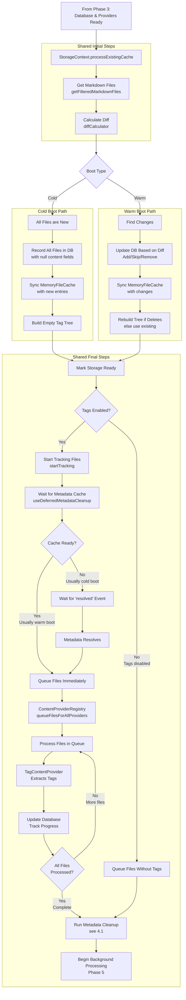

# Notebook Navigator Startup Process

## Table of Contents

- [Overview](#overview)
- [Key Concepts](#key-concepts)
  - [Cold Boot](#cold-boot)
  - [Warm Boot](#warm-boot)
  - [Version System](#version-system)
- [Startup Phases](#startup-phases)
  - [Phase 1: Plugin Registration](#phase-1-plugin-registration-maints)
  - [Phase 2: View Creation](#phase-2-view-creation-notebooknavigatorviewtsx)
  - [Phase 3: Database Version Check](#phase-3-database-version-check-and-initialization)
  - [Phase 4: Initial Data Load](#phase-4-initial-data-load-and-metadata-resolution)
  - [Phase 5: Background Processing](#phase-5-background-processing)
- [Critical Timing Mechanisms](#critical-timing-mechanisms)
  - [RequestIdleCallback Polyfill](#requestidlecallback-polyfill)
  - [Debouncing Strategies](#debouncing-strategies)

## Overview

The Notebook Navigator plugin has a multi-phase startup process that handles data synchronization and content
generation. The startup behavior differs between cold boots (first launch) and warm boots (subsequent launches).

## Key Concepts

### Cold Boot

A **cold boot** occurs when:

- The plugin is installed for the first time
- The IndexedDB database doesn't exist
- Database schema version has changed (DB_SCHEMA_VERSION)
- Content version has changed (DB_CONTENT_VERSION)

Characteristics:

- Full database initialization required
- All files need content generation
- Database is either created new or cleared completely

### Warm Boot

A **warm boot** occurs when:

- Obsidian is restarted with the plugin already enabled
- The plugin is enabled after being disabled
- Database exists with valid schema and content versions

Characteristics:

- Database already exists with cached data
- Only changed files need processing
- Metadata cache is typically ready immediately

### Version System

The plugin uses two version numbers to manage database state:

**DB_SCHEMA_VERSION**: Controls the IndexedDB structure

- Changes when database schema is modified (new indexes, stores, etc.)
- Triggers complete database recreation on change

**DB_CONTENT_VERSION**: Controls the data format

- Changes when content structure or generation logic is modified
- Triggers data clearing but preserves database structure
- Examples: changing how previews are generated, tag extraction logic updates

Both versions are stored in localStorage to detect changes between sessions.

Both version changes result in a cold boot to ensure data consistency.

## Startup Phases

### Phase 1: Plugin Registration (main.ts)

**Trigger**: Obsidian calls Plugin.onload() when enabling the plugin

```
1. Plugin.onload() called by Obsidian
2. Load settings from data.json
3. Initialize core services:
   - LocalStorage (vault-specific storage)
   - IconService (icon providers)
   - MetadataService (colors, icons, sort overrides, appearance overrides)
   - TagOperations (tag manipulation)
   - TagTreeService (tag hierarchy)
   - CommandQueueService (operation tracking)
4. Register view type with Obsidian
5. Register commands and event handlers
6. Add ribbon icon
7. Wait for workspace.onLayoutReady()
   - When ready, calls activateView() if no navigator exists
```

### Phase 2: View Creation (NotebookNavigatorView.tsx)

**Trigger**: activateView() creates the view via workspace.getLeaf()

```
1. Obsidian calls onOpen() when view is created
2. React app mounted with context providers:
   - SettingsProvider (user preferences)
   - ServicesProvider (dependency injection)
   - StorageProvider (data management)
   - ExpansionProvider (UI state)
   - SelectionProvider (selected items)
   - UIStateProvider (pane focus)
3. Container renders skeleton view while storage initializes:
   - Shows placeholder panes with saved dimensions
   - Provides immediate visual feedback
   - Prevents layout shift when data loads
4. Mobile detection adds platform-specific class and determines UI layout:
   - Desktop: NavigationPaneHeader and ListPaneHeader at top of panes
   - Mobile: NavigationToolbar and ListToolbar at bottom of panes
   - Touch optimizations and swipe gestures enabled on mobile
```

### Phase 3: Database Version Check and Initialization

**Trigger**: StorageProvider mounts in React component tree (from Phase 2)

```
1. StorageContext useEffect runs on mount
2. Calls IndexedDBStorage.init()
3. Version check process:
   - Check stored versions in localStorage
   - Compare DB_SCHEMA_VERSION and DB_CONTENT_VERSION
   - Determine boot type:
     * No stored versions → First install → Cold boot
     * Schema change → Delete database → Cold boot
     * Content change → Clear data → Cold boot
     * Versions match → Warm boot
4. Store current versions in localStorage
5. Open/create database based on boot type
```

#### Cold Boot Path (database empty or cleared):

```
1. Create new database or clear existing data
2. Initialize empty MemoryFileCache
3. Initialize content provider registry:
   - PreviewContentProvider
   - FeatureImageContentProvider
   - MetadataContentProvider
   - TagContentProvider
4. Continue to Phase 4 with empty database
```

#### Warm Boot Path (database has existing data):

```
1. Open existing database
2. Load all existing data into MemoryFileCache
3. Initialize content provider registry (same providers as cold boot)
4. Continue to Phase 4 with cached data
```

### Phase 4: Initial Data Load and Metadata Resolution

**Trigger**: Database initialization completes (from Phase 3)

This phase handles the initial synchronization between the vault and the database, then ensures metadata is ready for
tag extraction:

#### Shared Initial Steps:

```
1. StorageContext: Begin processing (processExistingCache)
   - Cold boot: isInitialLoad=true (synchronous)
   - Warm boot: isInitialLoad=false (uses requestIdleCallback)
2. Get all markdown files from vault (getFilteredMarkdownFiles)
3. Calculate diff via diffCalculator
   - Cold boot: All files appear as new (database is empty)
   - Warm boot: Compare against cached data to find changes
```

#### Cold Boot Specific:

```
4. Record all files in IndexedDB with basic metadata only
   - Store path and mtime (modification time)
   - Set content fields to null (tags, preview, featureImage, metadata)
   - Null fields act as flags that content needs to be generated
5. Sync MemoryFileCache with new database entries
   - Updates the empty memory cache with the new file records
6. Build empty tag tree via TagTreeBuilder
   - Creates the tree structure but with no tags since none are extracted yet
```

#### Warm Boot Specific:

```
4. Update IndexedDB based on diff results:
   - Add new files with null content fields (recordFileChanges)
   - Don't update entries for modified files (keeps old mtime in database)
   - The mtime difference (file.mtime != db.mtime) triggers content regeneration later
   - Remove deleted files (removeFilesFromCache)
5. Sync MemoryFileCache with any database changes
   - Cache already loaded in Phase 3, just sync changes
6. Rebuild tag tree only if files were deleted
   - Otherwise use existing tree from memory cache
```

#### Shared Final Steps:

```
7. Mark storage as ready (setIsStorageReady(true))
   - Cold boot: UI can now render with files visible but no content
   - Warm boot: UI renders immediately with cached content
8. If tags enabled (settings.showTags):
   - Start tracking files needing tags (startTracking)
   - Wait for metadata cache (useDeferredMetadataCleanup.waitForMetadataCache)
   - Both cold and warm boot wait, but warm boot typically resolves immediately
9. When metadata cache ready:
   - Queue files (ContentProviderRegistry.queueFilesForAllProviders)
   - Tag extraction begins immediately
10. Begin background processing (see Phase 5)
    - Cold boot: All files need content generation
    - Warm boot: Only changed files and files with null content fields
```

#### Data Flow Diagram

The metadata cache resolution and tag extraction process is managed by the `useDeferredMetadataCleanup` hook:



#### 4.1 Metadata Cleanup Process:

**Purpose**: Remove orphaned metadata for folders, tags, and files that no longer exist in the vault. This prevents the
settings file from growing indefinitely with obsolete data.

**Timing**:

- With tags enabled: Runs after all tags are extracted
- With tags disabled: Runs immediately after files are queued

**Architecture**: The cleanup uses "validators" - data structures that contain the current state of the vault (which
files, folders, and tags actually exist). The cleanup process compares stored metadata against these validators to
identify and remove orphaned entries:

```typescript
// Prepare validators with current vault state (files, folders, tags)
const validators = MetadataService.prepareCleanupValidators(app, tagTree);

// Run unified cleanup using validators to identify orphaned metadata
await metadataService.runUnifiedCleanup(validators);
```

**Validator Preparation** (`MetadataService.prepareCleanupValidators`):

Validators are data structures containing the current "truth" about what exists in the vault:

```
1. Collect vault files:
   - Get all markdown files from vault
   - Store as set of all file paths

2. Collect vault folders:
   - Recursively traverse folder tree from root
   - Collect actual folder paths directly from vault structure
   - Store as set of all folder paths including empty folders

3. Create validators object containing:
   - dbFiles: All files from IndexedDB (for cross-referencing)
   - tagTree: Combined favorite and regular tag trees (empty Map if tags disabled)
   - vaultFiles: Set of all file paths that currently exist
   - vaultFolders: Set of all folder paths that currently exist
```

**Cleanup Operations** (`runUnifiedCleanup`):

Using the validators, the cleanup removes orphaned metadata:

```
1. Validate folder metadata (always runs):
   - Compare stored folder settings against vaultFolders validator
   - Check each folder color/icon/sort/appearance setting
   - Remove settings for folders not in vaultFolders set

2. Validate pinned notes (always runs):
   - Compare pinned file paths against vaultFiles validator
   - Check each folder's pinned notes list
   - Remove references to files not in vaultFiles set

3. Validate tag metadata (only when tag tree provided):
   - Compare stored tag settings against tagTree validator
   - Check each tag color/icon/sort/appearance setting
   - Remove settings for tags not in tagTree

4. Save cleaned settings:
   - Write updated settings back to data.json if any changes were made
```

### Phase 5: Background Processing

**Trigger**: Files queued by ContentProviderRegistry (from Phase 4)

Content is generated asynchronously in the background by the ContentProviderRegistry and individual providers:

1. **File Detection**: Each provider checks if files need processing
   - TagContentProvider: Checks if tags are null or file modified
   - PreviewContentProvider: Checks if preview is null or file modified
   - FeatureImageContentProvider: Checks if featureImage is null or file modified
   - MetadataContentProvider: Checks if metadata is null or file modified

2. **Queue Management**: Files are queued based on enabled settings
   - ContentProviderRegistry manages the queue
   - Processes files in batches to avoid blocking UI
   - Uses requestIdleCallback for background processing

3. **Processing**: Each provider processes files independently
   - TagContentProvider: Extracts tags from app.metadataCache.getFileCache()
   - PreviewContentProvider: Reads file content via app.vault.cachedRead()
   - FeatureImageContentProvider: Checks frontmatter properties via app.metadataCache.getFileCache(), falls back to
     checking embedded images using app.metadataCache.getFirstLinkpathDest()
   - MetadataContentProvider: Extracts custom frontmatter fields from app.metadataCache.getFileCache()

4. **Database Updates**: Results stored in IndexedDB
   - Each provider returns updates to IndexedDBStorage
   - Database fires content change events

5. **Memory Sync**: MemoryFileCache automatically synced with IndexedDB changes

6. **UI Updates**: StorageContext listens for database changes
   - Tag changes trigger tag tree rebuild (buildTagTreeFromDatabase)
   - Components re-render with new content via React context

## Critical Timing Mechanisms

### RequestIdleCallback Polyfill

For browsers without native support (Safari):

- Provides fallback using setTimeout
- Ensures non-blocking startup operations
- Used for background processing and cleanup

### Debouncing Strategies

The plugin uses two debouncing approaches:

**Leading Edge Debouncing** (custom implementation):

- Used for: Vault events (create, delete, rename)
- First event triggers immediate processing
- Subsequent events within timeout are batched
- Ensures responsive UI while preventing spam

**Obsidian's Built-in Debounce**:

- Used for: Settings changes, window resize, scroll events
- Example: `debounce(this.handleResize, 200, true)`
- Leverages Obsidian's optimized debouncer
- Prevents excessive re-renders and calculations
