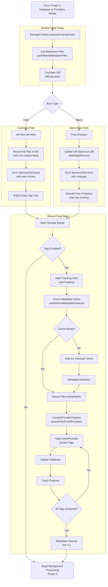

# Notebook Navigator Startup Process

## Overview

The Notebook Navigator plugin has a multi-phase startup process that handles data synchronization and content generation. The startup behavior differs between cold boots (first launch) and warm boots (subsequent launches).

## Key Concepts

### Cold Boot
A **cold boot** occurs when:
- The plugin is installed for the first time
- The plugin is enabled after being disabled
- The IndexedDB database doesn't exist or is corrupted
- The browser/app data has been cleared

Characteristics:
- Full database initialization required
- Complete vault scan and indexing
- All content needs to be generated
- Waits for Obsidian's metadata cache to be ready
- Slower initial load but ensures complete data integrity

### Warm Boot
A **warm boot** occurs when:
- Obsidian is restarted with the plugin already enabled
- The plugin is reloaded (during development or updates)
- The view is reopened after being closed

Characteristics:
- Database already exists with cached data
- Only changed files need processing
- Incremental updates via diff calculation
- Skips metadata cache wait if data exists
- Much faster startup time

## Startup Phases

### Phase 1: Plugin Registration (main.ts)
```
1. Plugin.onload() called by Obsidian
2. Load settings from data.json
3. Initialize core services:
   - LocalStorage (vault-specific storage)
   - MobileLogger (for mobile debugging)
   - IconService (icon providers)
   - MetadataService (colors, icons, sort overrides)
   - TagOperations (tag manipulation)
   - TagTreeService (tag hierarchy)
   - CommandQueueService (operation tracking)
4. Register view type with Obsidian
5. Register commands and event handlers
6. Add ribbon icon
7. Wait for workspace.onLayoutReady()
```

### Phase 2: View Creation (NotebookNavigatorView.tsx)
```
1. View created when opened (auto or manual)
2. React app mounted with context providers:
   - SettingsProvider (user preferences)
   - ServicesProvider (dependency injection)
   - StorageProvider (data management)
   - ExpansionProvider (UI state)
   - SelectionProvider (selected items)
   - UIStateProvider (pane focus)
3. Container element prepared
4. Mobile detection and class application
```

### Phase 3: Storage Initialization (StorageContext.tsx)

#### Cold Boot Path:
```
1. Initialize IndexedDB with app ID
2. Create database schema if needed
3. Initialize empty MemoryFileCache
4. Initialize content provider registry:
   - PreviewContentProvider
   - FeatureImageContentProvider
   - MetadataContentProvider
   - TagContentProvider
```

#### Warm Boot Path:
```
1. Initialize IndexedDB with app ID
2. Open existing database
3. Load all existing data into MemoryFileCache
4. Initialize content provider registry:
   - PreviewContentProvider
   - FeatureImageContentProvider
   - MetadataContentProvider
   - TagContentProvider
```

### Phase 4: Initial Data Load and Metadata Resolution

This phase handles the initial synchronization between the vault and the database, then ensures metadata is ready for tag extraction:

#### Shared Initial Steps:
```
1. StorageContext: Begin processing (processExistingCache)
   - Cold boot: isInitialLoad=true (synchronous)
   - Warm boot: isInitialLoad=false (uses requestIdleCallback)
2. Get all markdown files from vault (getFilteredMarkdownFiles)
3. Calculate diff via diffCalculator
   - Cold boot: All files appear as new (database is empty)
   - Warm boot: Compare against cached data to find changes
```

#### Cold Boot Specific:
```
4. Record all files in IndexedDB with basic metadata only
   - Store path and mtime (modification time)
   - Set content fields to null (tags, preview, featureImage, metadata)
   - Null fields act as flags that content needs to be generated
5. Sync MemoryFileCache with new database entries
   - Updates the empty memory cache with the new file records
6. Build empty tag tree via TagTreeBuilder
   - Creates the tree structure but with no tags since none are extracted yet
```

#### Warm Boot Specific:
```
4. Update IndexedDB based on diff results:
   - Add new files with null content fields (recordFileChanges)
   - Don't update entries for modified files (keeps old mtime in database)
   - The mtime difference (file.mtime != db.mtime) triggers content regeneration later
   - Remove deleted files (removeFilesFromCache)
5. Sync MemoryFileCache with any database changes
   - Cache already loaded in Phase 3, just sync changes
6. Rebuild tag tree only if files were deleted
   - Otherwise use existing tree from memory cache
```

#### Shared Final Steps:
```
7. Mark storage as ready (setIsStorageReady(true))
   - Cold boot: UI can now render with files visible but no content
   - Warm boot: UI renders immediately with cached content
8. If tags enabled (settings.showTags):
   - Start tracking files needing tags (startTracking)
   - Check metadata cache (useDeferredMetadataCleanup.waitForMetadataCache)
9. If metadata cache ready:
   - Queue files immediately (ContentProviderRegistry.queueFilesForAllProviders)
10. If metadata cache not ready:
    - Wait for 'resolved' event from Obsidian
    - Then queue files
11. Begin background processing (see Phase 5)
    - Cold boot: All files need content generation
    - Warm boot: Only changed files and files with null content fields
```

The metadata cache resolution and tag extraction process is managed by the `useDeferredMetadataCleanup` hook:



The tracking ensures that metadata cleanup only runs after all tags have been extracted from the vault files.

#### 4.1 Metadata Cleanup Process:
When all tags are extracted, MetadataService.runUnifiedCleanup performs:
```
1. Gather validation data:
   - Get all files from database
   - Get complete tag tree (with all extracted tags)
   - Get all files from vault
2. Validate tag metadata:
   - Check each tag color/icon/sort setting
   - Remove settings for tags that no longer exist
3. Validate folder metadata:
   - Check each folder color/icon/sort setting
   - Remove settings for folders that no longer exist
4. Clean favorite tags:
   - Remove favorites for tags that don't exist
5. Clean hidden tags:
   - Remove hidden tags that don't exist
6. Save cleaned settings:
   - Write updated settings back to data.json
```

### Phase 5: Background Processing

Content is generated asynchronously in the background by the ContentProviderRegistry and individual providers:

1. **File Detection**: Each provider checks if files need processing
   - TagContentProvider: Checks if tags are null or file modified
   - PreviewContentProvider: Checks if preview is null or file modified
   - FeatureImageContentProvider: Checks if featureImage is null or file modified
   - MetadataContentProvider: Checks if metadata is null or file modified

2. **Queue Management**: Files are queued based on enabled settings
   - ContentProviderRegistry manages the queue
   - Processes files in batches to avoid blocking UI
   - Uses requestIdleCallback for background processing

3. **Processing**: Each provider processes files independently
   - TagContentProvider: Gets tags from app.metadataCache.getFileCache()
   - PreviewContentProvider: Reads file content via app.vault.cachedRead()
   - FeatureImageContentProvider: Checks frontmatter properties from metadata cache, falls back to metadata.embeds
   - MetadataContentProvider: Gets custom frontmatter fields from app.metadataCache.getFileCache()

4. **Database Updates**: Results stored in IndexedDB
   - Each provider returns updates to IndexedDBStorage
   - Database fires content change events

5. **Memory Sync**: MemoryFileCache automatically synced with IndexedDB changes

6. **UI Updates**: StorageContext listens for database changes
   - Tag changes trigger tag tree rebuild (buildTagTreeFromDatabase)
   - Components re-render with new content via React context

## Critical Timing Mechanisms

### RequestIdleCallback Polyfill

For browsers without native support (Safari):
- Provides fallback using setTimeout
- Ensures non-blocking startup operations
- Used for background processing and cleanup

### Debouncing Strategies

The plugin uses two debouncing approaches:

**Leading Edge Debouncing** (custom implementation):
- Used for: Vault events (create, delete, rename)
- First event triggers immediate processing
- Subsequent events within timeout are batched
- Ensures responsive UI while preventing spam

**Obsidian's Built-in Debounce**:
- Used for: Settings changes, window resize, scroll events
- Example: `debounce(this.handleResize, 200, true)`
- Leverages Obsidian's optimized debouncer
- Prevents excessive re-renders and calculations


