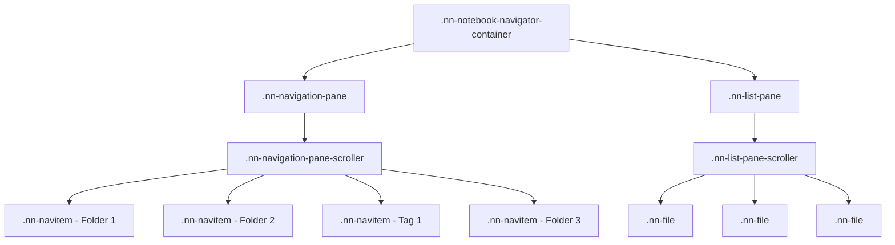

# Notebook Navigator Theming Guide

This guide helps theme developers add support for Notebook Navigator's unique
CSS structure. Notebook Navigator replaces Obsidian's default file explorer with
a custom dual-pane interface that uses different CSS classes and DOM structure.

## CSS Custom Properties Reference

All Notebook Navigator CSS variables are defined at the `body` level and can be customized through the Style Settings plugin or CSS snippets.

### Global Appearance

| Property | Default | Description |
| -------- | ------- | ----------- |
| `--nn-theme-nav-pane-bg` | `var(--background-secondary)` | Navigation pane background |
| `--nn-theme-list-pane-bg` | `var(--background-primary)` | File list pane background |
| `--nn-theme-resize-handle-bg` | `transparent` | Resize handle background |
| `--nn-theme-resize-handle-hover-bg` | `var(--interactive-accent)` | Resize handle hover background |

### Navigation Pane Header

| Property | Default | Description |
| -------- | ------- | ----------- |
| `--nn-theme-header-nav-bg` | `var(--background-secondary)` | Navigation header background |
| `--nn-theme-header-border-color` | `var(--background-modifier-border)` | Header border color |
| `--nn-theme-header-breadcrumb-color` | `var(--text-muted)` | Header title/breadcrumb color |
| `--nn-theme-header-icon-color` | `var(--text-muted)` | Header icon color |

### Header Action Buttons

| Property | Default | Description |
| -------- | ------- | ----------- |
| `--nn-theme-action-button-color` | `var(--text-muted)` | Action button icon color |
| `--nn-theme-action-button-hover-bg` | `var(--background-modifier-hover)` | Action button hover background |
| `--nn-theme-action-button-active-bg` | `var(--background-modifier-hover)` | Active/toggled button background |
| `--nn-theme-action-button-active-color` | `var(--text-normal)` | Active/toggled button icon color |
| `--nn-theme-action-button-disabled-color` | `var(--text-muted)` | Disabled button icon color |

### Navigation Items (Folders & Tags)

| Property | Default | Description |
| -------- | ------- | ----------- |
| `--nn-theme-nav-item-text-color` | `var(--text-normal)` | Folder/tag name color |
| `--nn-theme-nav-item-icon-color` | `var(--text-muted)` | Folder/tag icon color |
| `--nn-theme-nav-item-chevron-color` | `var(--text-muted)` | Expand/collapse arrow color |
| `--nn-theme-nav-item-chevron-hover-color` | `var(--text-normal)` | Chevron hover color |
| `--nn-theme-nav-item-count-color` | `var(--text-muted)` | File count badge text |
| `--nn-theme-nav-item-count-bg` | `transparent` | File count badge background |
| `--nn-theme-nav-item-hover-bg` | `var(--background-modifier-hover)` | Item hover background |
| `--nn-theme-nav-item-selection-bg` | `var(--text-selection)` | Selected item background |
| `--nn-theme-nav-item-selection-inactive-bg` | `var(--background-modifier-hover)` | Selected item (unfocused pane) |

### Folder Depth Colors

| Property | Default | Description |
| -------- | ------- | ----------- |
| `--nn-theme-folder-level-0-color` | `var(--text-normal)` | Root level folder color |
| `--nn-theme-folder-level-1-color` | `var(--text-normal)` | Level 1 folder color |
| `--nn-theme-folder-level-2-color` | `var(--text-normal)` | Level 2 folder color |
| `--nn-theme-folder-level-3-color` | `var(--text-normal)` | Level 3+ folder color |

### File List Header

| Property | Default | Description |
| -------- | ------- | ----------- |
| `--nn-theme-header-list-bg` | `var(--background-primary)` | File list header background |

### File List Items

| Property | Default | Description |
| -------- | ------- | ----------- |
| `--nn-theme-file-name-color` | `var(--text-normal)` | File name color |
| `--nn-theme-file-name-weight` | `600` | File name font weight |
| `--nn-theme-file-preview-color` | `var(--text-muted)` | Preview text color |
| `--nn-theme-file-date-color` | `var(--text-faint)` | Modified date color |
| `--nn-theme-file-folder-path-color` | `var(--text-muted)` | Parent folder path color |
| `--nn-theme-file-selection-bg` | `var(--text-selection)` | Selected file background |
| `--nn-theme-file-selection-inactive-bg` | `var(--background-modifier-hover)` | Selected file (unfocused pane) |

### File List Separators & Groups

| Property | Default | Description |
| -------- | ------- | ----------- |
| `--nn-theme-file-separator-color` | `var(--background-modifier-border)` | File divider line color |
| `--nn-theme-file-date-header-color` | `var(--text-muted)` | Date group header color |

### Interaction & Feedback

| Property | Default | Description |
| -------- | ------- | ----------- |
| `--nn-theme-drag-badge-bg` | `#dc3545` | Drag count badge background |
| `--nn-theme-drag-badge-color` | `white` | Drag count badge text |
| `--nn-theme-empty-state-color` | `var(--text-muted)` | "No files" message color |

### Mobile Styles

| Property | Default | Description |
| -------- | ------- | ----------- |
| `--nn-theme-mobile-tab-icon-color` | `var(--text-muted)` | Tab bar icon color |
| `--nn-theme-mobile-tab-active-bg` | `var(--background-modifier-hover)` | Active tab background |
| `--nn-theme-mobile-tab-active-icon-color` | `var(--text-normal)` | Active tab icon color |

## Key Differences from Default Explorer

| Aspect            | Obsidian Default   | Notebook Navigator              |
| ----------------- | ------------------ | ------------------------------- |
| **Class Prefix**  | `.nav-folder`      | `.nn-navitem`                   |
| **DOM Structure** | Nested hierarchy   | Flat list (virtual scrolling)   |
| **Items Types**   | Folders only       | Folders AND tags (same classes) |
| **Layout**        | Single tree        | Dual-pane (navigation + files)  |
| **File Display**  | Mixed with folders | Separate list pane              |

### Important Notes

1. **Virtual Scrolling**: We use virtual scrolling for performance, meaning
   folders are NOT nested in the DOM. All items are siblings in a flat list.
2. **Shared Classes**: Both folders and tags use `.nn-navitem` classes since
   they serve the same navigation purpose.
3. **No nav-files-container**: Unlike the default explorer, we don't mix files
   with folders. Files are in a separate pane.

## CSS Class Reference

### Navigation Pane Classes

| Class                          | Description                     | Obsidian Equivalent              |
| ------------------------------ | ------------------------------- | -------------------------------- |
| `.nn-navigation-pane`          | Navigation pane container       | `.nav-folder-container`          |
| `.nn-navigation-pane-scroller` | Scrollable area                 | `.nav-folder-children`           |
| `.nn-navitem`                  | Base class for all nav items    | `.nav-folder`                    |
| `.nn-navitem.nn-folder`        | Folder items specifically       | `.nav-folder`                    |
| `.nn-navitem.nn-tag`           | Tag items specifically          | _(no equivalent)_                |
| `.nn-navitem-content`          | Clickable content area          | `.nav-folder-title`              |
| `.nn-navitem-chevron`          | Expand/collapse arrow           | `.nav-folder-collapse-indicator` |
| `.nn-navitem-icon`             | Folder/tag icon                 | _(no equivalent)_                |
| `.nn-navitem-name`             | Item text                       | `.nav-folder-title-content`      |
| `.nn-navitem-count`            | File count badge                | _(no equivalent)_                |
| `.nn-pane-header-text`         | Breadcrumb path in list header  | _(no equivalent)_                |
| `.nn-pane-header-icon`         | Icon in pane header             | _(no equivalent)_                |
| `.nn-icon-button`              | Action buttons in headers       | _(no equivalent)_                |
| `.nn-icon-button-active`       | Active state for toggle buttons | _(no equivalent)_                |
| `.nn-mobile-title`             | Mobile breadcrumb path          | _(no equivalent)_                |
| `.nn-tab-bar-button`           | Mobile tab bar buttons          | _(no equivalent)_                |
| `.nn-tab-bar-button-active`    | Active mobile tab button        | _(no equivalent)_                |
| `.nn-navitem.nn-selected`      | Selected item                   | `.nav-folder.is-selected`        |

### File List Pane Classes

| Class                    | Description                             |
| ------------------------ | --------------------------------------- |
| `.nn-list-pane`          | File list container                     |
| `.nn-list-pane-scroller` | Scrollable file list                    |
| `.nn-file`               | Individual file                         |
| `.nn-file-name`          | File name text                          |
| `.nn-file-preview`       | Preview text                            |
| `.nn-file-date`          | Modified date                           |
| `.nn-file-folder`        | Parent folder (when showing subfolders) |
| `.nn-file-tags`          | Tag container                           |
| `.nn-file-tags .nn-tag`  | Individual tag badge                    |
| `.nn-file.nn-selected`   | Selected file                           |
| `.nn-date-group-header`  | Date group headers (Today, Yesterday)   |

### State Classes

| Class                  | When Applied               |
| ---------------------- | -------------------------- |
| `.nn-selected`         | Item is selected           |
| `.nn-focused`          | Item has keyboard focus    |
| `.nn-expanded`         | Folder/tag is expanded     |
| `.nn-has-custom-color` | User set custom color      |
| `.nn-has-folder-note`  | Folder has associated note |
| `.nn-pinned`           | File is pinned             |

## DOM Structure

### Actual DOM Structure (Virtual Scrolling)



### Navigation Item Structure

```html
<div class="nn-navitem" data-path="/folder/path" data-level="0">
  <div class="nn-navitem-content">
    <div class="nn-navitem-chevron nn-navitem-chevron--has-children"></div>
    <span class="nn-navitem-icon">
      <!-- Lucide icon or emoji -->
    </span>
    <span class="nn-navitem-name">Folder Name</span>
    <span class="nn-navitem-spacer"></span>
    <span class="nn-navitem-count">42</span>
  </div>
</div>
```

### File Item Structure

```html
<div class="nn-file" data-path="path/to/file.md">
  <div class="nn-file-inner">
    <div class="nn-file-header">
      <div class="nn-file-title-row">
        <span class="nn-file-name">Note Title</span>
      </div>
      <div class="nn-file-date">2 hours ago</div>
      <div class="nn-file-tags">
        <span class="nn-tag">#tag1</span>
        <span class="nn-tag">#tag2</span>
      </div>
    </div>
    <div class="nn-file-preview">Preview text appears here...</div>
  </div>
</div>
```

## Style Settings Plugin Integration

Notebook Navigator fully supports the [Style Settings plugin](https://github.com/mgmeyers/obsidian-style-settings), allowing users to customize all theme variables through a user-friendly interface without writing CSS.

### Using Style Settings

1. Install the Style Settings plugin from Obsidian's Community Plugins
2. Enable Style Settings in your vault
3. Go to Settings → Style Settings
4. Look for "Notebook Navigator" section
5. Customize any of the available variables through the UI

All the CSS variables listed in this guide are available through Style Settings with organized sections:
- **Global Appearance** - Pane backgrounds and resize handle
- **Navigation Pane** - Headers, folders, tags, and action buttons
- **File List Pane** - Headers, file items, and separators  
- **Interaction & Feedback** - Drag/drop and empty states
- **Mobile Styles** - Tab bar customization

### Theme Developer Note

When creating themes for Notebook Navigator:
- Define your custom values for the `--nn-theme-*` variables at the `body` level
- Users can then further customize your theme through Style Settings
- Your theme values become the new defaults that users can override

## Quick Start

### Installation Instructions

1. Open Obsidian Settings (`Cmd/Ctrl + ,`)
2. Navigate to **Appearance** tab
3. Scroll down to **CSS snippets** section
4. Click **Open snippets folder** button
5. Create a new file called `notebook-navigator-theme.css`
6. Paste the CSS below
7. Return to Obsidian Settings > Appearance
8. Click the **Reload snippets** button
9. Toggle on your new snippet

### Complete Theme Example

Use this complete example as a starting point for your theme. All customization is done through CSS variables defined at the `body` level:

```css
/* ========================================
   NOTEBOOK NAVIGATOR THEME CUSTOMIZATION
   All variables are defined at body level
   ======================================== */

body {
  /* ========================================
     GLOBAL APPEARANCE
     ======================================== */
  
  /* Pane backgrounds */
  --nn-theme-nav-pane-bg: #e6e9ff;        /* Light purple navigation pane */
  --nn-theme-list-pane-bg: #e8fcfb;       /* Light cyan file list pane */
  
  /* Resize handle */
  --nn-theme-resize-handle-bg: #e8fcfb;   /* Match list pane background */
  --nn-theme-resize-handle-hover-bg: #a8edea;  /* Cyan on hover */

  /* ========================================
     NAVIGATION PANE (Folders & Tags)
     ======================================== */
  
  /* Header */
  --nn-theme-header-nav-bg: #e6e9ff;
  --nn-theme-header-border-color: #a78bfa;
  --nn-theme-header-breadcrumb-color: #475569;
  --nn-theme-header-icon-color: #8b5cf6;
  
  /* Action buttons */
  --nn-theme-action-button-color: #6366f1;
  --nn-theme-action-button-hover-bg: #fef3c7;
  --nn-theme-action-button-active-bg: #ddd6fe;
  --nn-theme-action-button-active-color: #7c3aed;
  --nn-theme-action-button-disabled-color: #94a3b8;
  
  /* Folder & tag items */
  --nn-theme-nav-item-text-color: #4a5568;
  --nn-theme-nav-item-icon-color: #667eea;
  --nn-theme-nav-item-chevron-color: #94a3b8;
  --nn-theme-nav-item-chevron-hover-color: #475569;
  --nn-theme-nav-item-count-color: white;
  --nn-theme-nav-item-count-bg: #f093fb;
  --nn-theme-nav-item-hover-bg: #fee140;
  --nn-theme-nav-item-selection-bg: #667eea;
  --nn-theme-nav-item-selection-inactive-bg: #f093fb;
  
  /* Folder depth colors */
  --nn-theme-folder-level-0-color: #2563eb;
  --nn-theme-folder-level-1-color: #3b82f6;
  --nn-theme-folder-level-2-color: #60a5fa;
  --nn-theme-folder-level-3-color: #93c5fd;

  /* ========================================
     FILE LIST PANE
     ======================================== */
  
  /* Header */
  --nn-theme-header-list-bg: #e8fcfb;
  
  /* File items */
  --nn-theme-file-name-color: #1e293b;
  --nn-theme-file-name-weight: 600;
  --nn-theme-file-preview-color: #64748b;
  --nn-theme-file-date-color: #94a3b8;
  --nn-theme-file-folder-path-color: #a78bfa;
  --nn-theme-file-selection-bg: #a8edea;
  --nn-theme-file-selection-inactive-bg: #ffecd2;
  
  /* Separators & groups */
  --nn-theme-file-separator-color: #c8e6c9;
  --nn-theme-file-date-header-color: #64748b;

  /* ========================================
     INTERACTION & FEEDBACK
     ======================================== */
  
  /* Drag & drop */
  --nn-theme-drag-badge-bg: #dc3545;
  --nn-theme-drag-badge-color: white;
  
  /* Empty state */
  --nn-theme-empty-state-color: #94a3b8;

  /* ========================================
     MOBILE STYLES
     ======================================== */
  
  --nn-theme-mobile-tab-icon-color: #6366f1;
  --nn-theme-mobile-tab-active-bg: #ddd6fe;
  --nn-theme-mobile-tab-active-icon-color: #7c3aed;
}

/* ========================================
   ADDITIONAL STYLING (Optional)
   Beyond the variables, you can add custom styles
   ======================================== */

/* Example: Add padding to file count badges */
.nn-navitem-count {
  padding: 0 6px;
  border-radius: 10px;
}

/* Example: Different folder depth font weights */
.nn-navitem.nn-folder[data-level='0'] .nn-navitem-name {
  font-weight: 600;
}

/* Example: Style folder icons differently from tag icons */
.nn-navitem.nn-folder .nn-navitem-icon {
  opacity: 0.9;
}

.nn-navitem.nn-tag .nn-navitem-icon {
  opacity: 0.7;
}
```

## Advanced Techniques

### Supporting Light and Dark Modes

To support both light and dark modes, you need to define your styles twice -
once for each mode. Obsidian uses `.theme-light` and `.theme-dark` classes on
the body element.

#### Example: Mode-Aware Theme

```css
/* Light mode - pastel colors */
.theme-light {
  /* Navigation pane */
  --nn-theme-nav-pane-bg: #ffeeff; /* Light pink */
  --nn-theme-nav-item-selection-bg: #ffccff; /* Pastel purple */
  --nn-theme-nav-item-text-color: #ff66cc; /* Pink text */
  --nn-theme-nav-item-hover-bg: #ffddff; /* Very light pink */
  
  /* File list */
  --nn-theme-list-pane-bg: #fff0ff; /* Very light purple */
  --nn-theme-file-name-color: #cc33ff; /* Purple text */
  --nn-theme-file-selection-bg: #ffccff; /* Pastel purple */
  --nn-theme-file-preview-color: #ff99cc; /* Light pink */
}

/* Dark mode - pastel colors on dark */
.theme-dark {
  /* Navigation pane */
  --nn-theme-nav-pane-bg: #330033; /* Dark purple */
  --nn-theme-nav-item-selection-bg: #663366; /* Muted purple */
  --nn-theme-nav-item-text-color: #ffaaff; /* Light pink text */
  --nn-theme-nav-item-hover-bg: #442244; /* Dark purple hover */
  
  /* File list */
  --nn-theme-list-pane-bg: #2a002a; /* Very dark purple */
  --nn-theme-file-name-color: #ff99ff; /* Light purple text */
  --nn-theme-file-selection-bg: #663366; /* Muted purple */
  --nn-theme-file-preview-color: #cc99cc; /* Muted pink */
}
```

### User Custom Colors Override

Users can right-click any folder or tag and select "Change color" to override
your theme colors. When they do:

1. Their color is applied as an inline style (e.g., `style="color: #ff0000;"`)
2. The class `nn-has-custom-color` is added to the name element
3. Inline styles automatically override your theme CSS

**This means:** Write your theme CSS normally. User preferences will
automatically take priority when set.

### Different Styles for Custom vs. Theme Colors

```css
/* Default theme style for folders */
.nn-navitem.nn-folder .nn-navitem-name {
  color: #4a9eff;
  font-weight: 500;
}

/* When user has NOT set a custom color - add an underline */
.nn-navitem.nn-folder .nn-navitem-name:not(.nn-has-custom-color) {
  text-decoration: underline;
  text-underline-offset: 2px;
}

/* When user HAS set a custom color - make it italic */
.nn-navitem.nn-folder .nn-navitem-name.nn-has-custom-color {
  font-style: italic;
}
```

### Depth-Based Styling

Notebook Navigator provides CSS variables for folder depth colors and adds a `data-level` attribute to each item:

```css
/* Using CSS variables for depth colors */
body {
  --nn-theme-folder-level-0-color: #2563eb;  /* Root - dark blue */
  --nn-theme-folder-level-1-color: #3b82f6;  /* Level 1 - medium blue */
  --nn-theme-folder-level-2-color: #60a5fa;  /* Level 2 - light blue */
  --nn-theme-folder-level-3-color: #93c5fd;  /* Level 3+ - very light blue */
}

/* Or override directly with attribute selectors for more control */
.nn-navitem.nn-folder[data-level='0'] .nn-navitem-name {
  font-weight: 700;  /* Make root folders bold */
  text-transform: uppercase;
  letter-spacing: 0.05em;
}

.nn-navitem.nn-folder[data-level='1'] .nn-navitem-name {
  font-weight: 600;
}

.nn-navitem.nn-folder[data-level='2'] .nn-navitem-name {
  font-style: italic;
}
```

## Additional Resources

- [Notebook Navigator GitHub](https://github.com/johansan/notebook-navigator)
- [CSS Architecture Documentation](./storage-architecture.md)
- [API Reference](./api-reference.md)

## Need Help?

If you're a theme developer and need assistance adding Notebook Navigator
support:

1. Open an issue on the
   [GitHub repository](https://github.com/johansan/notebook-navigator/issues)
2. Tag it with "theme-support"
3. Include your theme name and specific challenges

We're happy to help make your theme compatible with Notebook Navigator!
