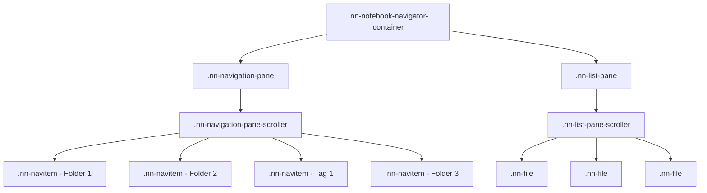

# Notebook Navigator Theming Guide

This guide helps theme developers add support for Notebook Navigator's unique
CSS structure. Notebook Navigator replaces Obsidian's default file explorer with
a custom dual-pane interface that uses different CSS classes and DOM structure.

## Quick Start: Rainbow Theme Demo

### Installation Instructions

1. Open Obsidian Settings (`Cmd/Ctrl + ,`)
2. Navigate to **Appearance** tab
3. Scroll down to **CSS snippets** section
4. Click **Open snippets folder** button
5. Create a new file called `notebook-navigator-theme.css`
6. Paste the demo CSS below
7. Return to Obsidian Settings > Appearance
8. Click the **Reload snippets** button
9. Toggle on your new snippet

### Complete Theme Demo

Copy this colorful theme to see all customization options:

```css
/* ================================================
   Notebook Navigator Rainbow Theme Demo
   This demonstrates ALL customizable properties
   ================================================ */

/* LAYOUT BACKGROUNDS
   ================================================ */

/* Navigation pane background */
.nn-navigation-pane-scroller {
  background: #e6e9ff;
}

/* File list pane background */
.nn-list-pane-scroller {
  background: #e8fcfb;
}

/* Pane headers */
.nn-navigation-pane .nn-pane-header {
  --nn-header-bg: #e6e9ff; /* Match navigation pane */
}

.nn-list-pane .nn-pane-header {
  --nn-header-bg: #e8fcfb; /* Match file list pane */
}

/* Header border/separator line */
.nn-pane-header {
  --nn-header-border-color: #a78bfa; /* Light purple */
}

/* Date group headers (Today, Yesterday, etc.) */
.nn-date-group-header {
  background: #e8fcfb;
  color: #64748b;
}

/* List pane header breadcrumb path */
.nn-pane-header-text {
  color: #475569 !important;
}

/* Pane header icons (folder icon, back button) */
.nn-pane-header-icon {
  color: #8b5cf6 !important;
}

.nn-pane-header-icon svg {
  stroke: #8b5cf6 !important;
}

/* Header action buttons (all buttons in both pane headers) */
.nn-icon-button {
  color: #6366f1 !important;
}

.nn-icon-button svg {
  stroke: #6366f1 !important;
}

.nn-icon-button:hover {
  background-color: #fef3c7 !important;
}

.nn-icon-button-active {
  background-color: #ddd6fe !important;
  color: #7c3aed !important;
}

.nn-icon-button-active svg {
  stroke: #7c3aed !important;
}

/* Resize handle between panes */
.nn-resize-handle {
  --nn-resize-bg: #e8fcfb;
  --nn-resize-hover-bg: #a8edea;
  --nn-resize-hover-opacity: 1;
  --nn-resize-active-opacity: 0.8;
}

/* Separator lines between files */
.nn-virtual-file-item {
  --nn-separator-color: #c8e6c9;
  --nn-separator-height: 2px;
}

/* NAVIGATION ITEMS (Folders & Tags)
   ================================================ */

/* Base navigation item styling */
.nn-navitem {
  background: #e6e9ff;

  /* Selection rectangles */
  --nn-selection-bg: #667eea;
  --nn-selection-bg-inactive: #f093fb;
  --nn-selection-radius: 12px;

  /* Hover rectangles */
  --nn-hover-bg: #fee140;
  --nn-hover-radius: 8px;
}

/* Folder-specific colors */
.nn-navitem.nn-folder {
  --nn-selection-bg: #667eea; /* Purple */
}

.nn-navitem.nn-folder .nn-navitem-name {
  color: #4a5568; /* Folder text color */
}

.nn-navitem.nn-folder .nn-navitem-icon {
  color: #667eea; /* Folder icon color */
}

/* Tag-specific colors */
.nn-navitem.nn-tag {
  --nn-selection-bg: #f093fb; /* Pink */
}

.nn-navitem.nn-tag .nn-navitem-name {
  color: #553c9a; /* Tag text color */
}

.nn-navitem.nn-tag .nn-navitem-icon {
  color: #f093fb; /* Tag icon color */
}

/* Virtual folders (Favorites, Tags containers) */
.nn-navitem.nn-virtual .nn-navitem-name {
  color: #64748b;
  font-style: italic;
}

/* Chevron arrows */
.nn-navitem-chevron {
  color: #94a3b8;
}

.nn-navitem-chevron:hover {
  color: #475569;
}

/* File count badges */
.nn-navitem-count {
  background: #f093fb;
  color: white;
  padding: 0 6px;
  border-radius: 10px;
}

/* FILE LIST ITEMS
   ================================================ */

/* Base file item styling */
.nn-file {
  background: #e8fcfb;

  /* Selection rectangles */
  --nn-selection-bg: #a8edea;
  --nn-selection-bg-inactive: #ffecd2;
  --nn-selection-radius: 16px;
}

/* File name text - need !important to override defaults */
.nn-file-name {
  color: #1e293b !important;
  font-weight: 500;
}

/* File preview text */
.nn-file-preview {
  color: #64748b !important;
}

/* File date text */
.nn-file-date {
  color: #94a3b8 !important;
}

/* Parent folder text (when showing notes from subfolders) */
.nn-file-folder {
  color: #a78bfa !important;
}

/* Tag badges in file list */
.nn-file-tags .nn-tag {
  background: #f093fb;
  color: white;
  padding: 2px 8px;
  border-radius: 12px;
}

/* Pinned files */
.nn-file.nn-pinned {
  background: #fff4e6;
}

.nn-file.nn-pinned .nn-file-name {
  color: #92400e;
}

/* DEPTH-BASED STYLING (Optional)
   ================================================ */

/* Root level folders - bold and darker */
.nn-navitem.nn-folder[data-level='0'] .nn-navitem-name {
  font-weight: 600;
  color: #2563eb;
}

/* Nested folders - progressively lighter */
.nn-navitem.nn-folder[data-level='1'] .nn-navitem-name {
  color: #3b82f6;
}

.nn-navitem.nn-folder[data-level='2'] .nn-navitem-name {
  color: #60a5fa;
}

/* Deep nesting - lighter */
.nn-navitem.nn-folder[data-level='3'] .nn-navitem-name,
.nn-navitem.nn-folder[data-level='4'] .nn-navitem-name {
  color: #93c5fd;
}
```

## CSS Custom Properties Reference

Notebook Navigator exposes these CSS custom properties for easy theming:

### Selection & Hover Effects

| Property                     | Element       | Default                            | Description                                 |
| ---------------------------- | ------------- | ---------------------------------- | ------------------------------------------- |
| `--nn-selection-bg`          | `.nn-navitem` | `var(--text-selection)`            | Background color when selected              |
| `--nn-selection-bg-inactive` | `.nn-navitem` | `var(--background-modifier-hover)` | Background when selected but pane unfocused |
| `--nn-selection-radius`      | `.nn-navitem` | `var(--radius-s)`                  | Border radius of selection rectangle        |
| `--nn-hover-bg`              | `.nn-navitem` | `var(--background-modifier-hover)` | Background color on hover                   |
| `--nn-hover-radius`          | `.nn-navitem` | `var(--radius-s)`                  | Border radius of hover rectangle            |
| `--nn-selection-bg`          | `.nn-file`    | `var(--text-selection)`            | File selection background                   |
| `--nn-selection-bg-inactive` | `.nn-file`    | `var(--background-modifier-hover)` | File selection when unfocused               |
| `--nn-selection-radius`      | `.nn-file`    | `var(--radius-m)`                  | File selection border radius                |

### Layout Components

| Property                     | Element                 | Default                             | Description                   |
| ---------------------------- | ----------------------- | ----------------------------------- | ----------------------------- |
| `--nn-header-bg`             | `.nn-pane-header`       | `var(--background-primary)`         | Pane header background        |
| `--nn-header-border-color`   | `.nn-pane-header`       | `var(--background-modifier-border)` | Header bottom border color    |
| `--nn-resize-bg`             | `.nn-resize-handle`     | `transparent`                       | Resize handle background      |
| `--nn-resize-hover-bg`       | `.nn-resize-handle`     | `var(--interactive-accent)`         | Resize handle hover color     |
| `--nn-resize-hover-opacity`  | `.nn-resize-handle`     | `0.5`                               | Resize handle hover opacity   |
| `--nn-resize-active-opacity` | `.nn-resize-handle`     | `0.8`                               | Resize handle drag opacity    |
| `--nn-separator-color`       | `.nn-virtual-file-item` | `var(--background-modifier-border)` | File separator line color     |
| `--nn-separator-height`      | `.nn-virtual-file-item` | `1px`                               | File separator line thickness |

## Key Differences from Default Explorer

| Aspect            | Obsidian Default   | Notebook Navigator              |
| ----------------- | ------------------ | ------------------------------- |
| **Class Prefix**  | `.nav-folder`      | `.nn-navitem`                   |
| **DOM Structure** | Nested hierarchy   | Flat list (virtual scrolling)   |
| **Items Types**   | Folders only       | Folders AND tags (same classes) |
| **Layout**        | Single tree        | Dual-pane (navigation + files)  |
| **File Display**  | Mixed with folders | Separate list pane              |

### Important Notes

1. **Virtual Scrolling**: We use virtual scrolling for performance, meaning
   folders are NOT nested in the DOM. All items are siblings in a flat list.
2. **Shared Classes**: Both folders and tags use `.nn-navitem` classes since
   they serve the same navigation purpose.
3. **No nav-files-container**: Unlike the default explorer, we don't mix files
   with folders. Files are in a separate pane.

## CSS Class Reference

### Navigation Pane Classes

| Class                          | Description                       | Obsidian Equivalent              |
| ------------------------------ | --------------------------------- | -------------------------------- |
| `.nn-navigation-pane`          | Navigation pane container         | `.nav-folder-container`          |
| `.nn-navigation-pane-scroller` | Scrollable area                   | `.nav-folder-children`           |
| `.nn-navitem`                  | Base class for all nav items      | `.nav-folder`                    |
| `.nn-navitem.nn-folder`        | Folder items specifically         | `.nav-folder`                    |
| `.nn-navitem.nn-tag`           | Tag items specifically            | _(no equivalent)_                |
| `.nn-navitem.nn-virtual`       | Virtual folders (Favorites, Tags) | _(no equivalent)_                |
| `.nn-navitem-content`          | Clickable content area            | `.nav-folder-title`              |
| `.nn-navitem-chevron`          | Expand/collapse arrow             | `.nav-folder-collapse-indicator` |
| `.nn-navitem-icon`             | Folder/tag icon                   | _(no equivalent)_                |
| `.nn-navitem-name`             | Item text                         | `.nav-folder-title-content`      |
| `.nn-navitem-count`            | File count badge                  | _(no equivalent)_                |
| `.nn-navitem.nn-selected`      | Selected item                     | `.nav-folder.is-selected`        |

### File List Pane Classes

| Class                    | Description          |
| ------------------------ | -------------------- |
| `.nn-list-pane`          | File list container  |
| `.nn-list-pane-scroller` | Scrollable file list |
| `.nn-file`               | Individual file      |
| `.nn-file-name`          | File name text       |
| `.nn-file-preview`       | Preview text         |
| `.nn-file-date`          | Modified date        |
| `.nn-file-tags`          | Tag badges           |
| `.nn-file.nn-selected`   | Selected file        |

### State Classes

| Class                  | When Applied               |
| ---------------------- | -------------------------- |
| `.nn-selected`         | Item is selected           |
| `.nn-focused`          | Item has keyboard focus    |
| `.nn-expanded`         | Folder/tag is expanded     |
| `.nn-has-custom-color` | User set custom color      |
| `.nn-has-folder-note`  | Folder has associated note |
| `.nn-pinned`           | File is pinned             |

## DOM Structure

### Actual DOM Structure (Virtual Scrolling)



### Navigation Item Structure

```html
<div class="nn-navitem" data-path="/folder/path" data-level="0">
  <div class="nn-navitem-content">
    <div class="nn-navitem-chevron nn-navitem-chevron--has-children"></div>
    <span class="nn-navitem-icon">
      <!-- Lucide icon or emoji -->
    </span>
    <span class="nn-navitem-name">Folder Name</span>
    <span class="nn-navitem-spacer"></span>
    <span class="nn-navitem-count">42</span>
  </div>
</div>
```

### File Item Structure

```html
<div class="nn-file" data-path="path/to/file.md">
  <div class="nn-file-inner">
    <div class="nn-file-header">
      <div class="nn-file-title-row">
        <span class="nn-file-name">Note Title</span>
      </div>
      <div class="nn-file-date">2 hours ago</div>
      <div class="nn-file-tags">
        <span class="nn-tag">#tag1</span>
        <span class="nn-tag">#tag2</span>
      </div>
    </div>
    <div class="nn-file-preview">Preview text appears here...</div>
  </div>
</div>
```

## Basic Theme Styling

### Text and Icon Colors

```css
/* Folder colors */
.nn-navitem.nn-folder .nn-navitem-name {
  color: #4a9eff;
}

.nn-navitem.nn-folder .nn-navitem-icon {
  color: #4a9eff;
}

/* Tag colors */
.nn-navitem.nn-tag .nn-navitem-name {
  color: #59d89e;
}

.nn-navitem.nn-tag .nn-navitem-icon {
  color: #59d89e;
}

/* File list colors - need !important to override defaults */
.nn-file-name {
  color: var(--text-normal) !important;
}

.nn-file-preview {
  color: var(--text-muted) !important;
}

.nn-file-date {
  color: var(--text-faint) !important;
}

.nn-file-folder {
  color: var(--text-muted) !important;
}

/* List pane header breadcrumb */
.nn-pane-header-text {
  color: var(--text-muted) !important;
}

/* Pane header icons and buttons */
.nn-pane-header-icon,
.nn-icon-button {
  color: var(--text-muted) !important;
}

.nn-pane-header-icon svg,
.nn-icon-button svg {
  stroke: var(--text-muted) !important;
}

.nn-icon-button:hover {
  background-color: var(--background-modifier-hover) !important;
}

.nn-icon-button-active {
  background-color: var(--background-modifier-hover) !important;
  color: var(--text-normal) !important;
}
```

### Custom Properties Usage

```css
/* Customize selection rectangles */
.nn-navitem {
  --nn-selection-bg: #667eea;
  --nn-selection-bg-inactive: rgba(102, 126, 234, 0.2);
  --nn-selection-radius: 12px;
  --nn-hover-bg: rgba(102, 126, 234, 0.1);
  --nn-hover-radius: 8px;
}

/* Different colors for folders vs tags */
.nn-navitem.nn-folder {
  --nn-selection-bg: var(--color-blue);
}

.nn-navitem.nn-tag {
  --nn-selection-bg: var(--color-green);
}
```

## Advanced Techniques

### User Custom Colors Override

Users can right-click any folder or tag and select "Change color" to override
your theme colors. When they do:

1. Their color is applied as an inline style (e.g., `style="color: #ff0000;"`)
2. The class `nn-has-custom-color` is added to the name element
3. Inline styles automatically override your theme CSS

**This means:** Write your theme CSS normally. User preferences will
automatically take priority when set.

### Different Styles for Custom vs. Theme Colors

```css
/* Default theme style for folders */
.nn-navitem.nn-folder .nn-navitem-name {
  color: #4a9eff;
  font-weight: 500;
}

/* When user has NOT set a custom color - add an underline */
.nn-navitem.nn-folder .nn-navitem-name:not(.nn-has-custom-color) {
  text-decoration: underline;
  text-underline-offset: 2px;
}

/* When user HAS set a custom color - make it italic */
.nn-navitem.nn-folder .nn-navitem-name.nn-has-custom-color {
  font-style: italic;
}
```

### Depth-Based Styling

Notebook Navigator adds a `data-level` attribute to each item indicating its
nesting depth (0 = root, 1 = first level, etc.):

```css
/* Root level folders - darker blue, bold */
.nn-navitem.nn-folder[data-level='0'] .nn-navitem-name {
  color: #2563eb;
  font-weight: 600;
}

/* First level nested - medium blue */
.nn-navitem.nn-folder[data-level='1'] .nn-navitem-name {
  color: #3b82f6;
}

/* Second level nested - lighter blue */
.nn-navitem.nn-folder[data-level='2'] .nn-navitem-name {
  color: #60a5fa;
}

/* Deep nesting (3+ levels) - very light */
.nn-navitem.nn-folder[data-level='3'] .nn-navitem-name,
.nn-navitem.nn-folder[data-level='4'] .nn-navitem-name {
  color: #93c5fd;
}
```

## Additional Resources

- [Notebook Navigator GitHub](https://github.com/johansan/notebook-navigator)
- [CSS Architecture Documentation](./storage-architecture.md)
- [API Reference](./api-reference.md)

## Need Help?

If you're a theme developer and need assistance adding Notebook Navigator
support:

1. Open an issue on the
   [GitHub repository](https://github.com/johansan/notebook-navigator/issues)
2. Tag it with "theme-support"
3. Include your theme name and specific challenges

We're happy to help make your theme compatible with Notebook Navigator!
