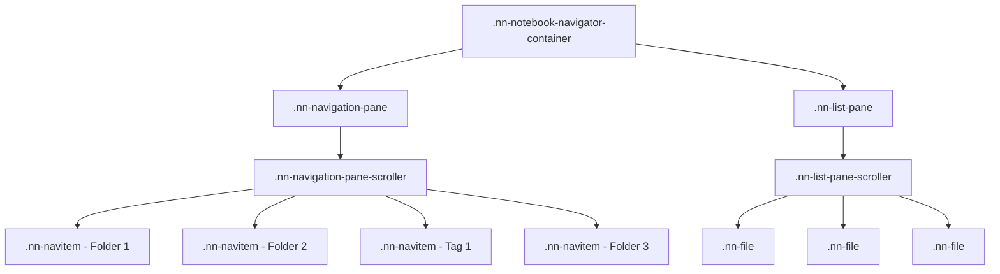

# Notebook Navigator Theming Guide

This guide helps theme developers add support for Notebook Navigator's unique
CSS structure. Notebook Navigator replaces Obsidian's default file explorer with
a custom dual-pane interface that uses different CSS classes and DOM structure.

## Table of Contents

- [Key Differences from Default Explorer](#key-differences-from-default-explorer)
- [CSS Class Reference](#css-class-reference)
- [DOM Structure](#dom-structure)
- [Common Theming Patterns](#common-theming-patterns)
- [Rainbow Folders Implementation](#rainbow-folders-implementation)
- [Testing Your Theme](#testing-your-theme)

## Key Differences from Default Explorer

| Aspect            | Obsidian Default   | Notebook Navigator              |
| ----------------- | ------------------ | ------------------------------- |
| **Class Prefix**  | `.nav-folder`      | `.nn-navitem`                   |
| **DOM Structure** | Nested hierarchy   | Flat list (virtual scrolling)   |
| **Items Types**   | Folders only       | Folders AND tags (same classes) |
| **Layout**        | Single tree        | Dual-pane (navigation + files)  |
| **File Display**  | Mixed with folders | Separate list pane              |

### Important Notes

1. **Virtual Scrolling**: We use virtual scrolling for performance, meaning
   folders are NOT nested in the DOM. All items are siblings in a flat list.
2. **Shared Classes**: Both folders and tags use `.nn-navitem` classes since
   they serve the same navigation purpose.
3. **No nav-files-container**: Unlike the default explorer, we don't mix files
   with folders. Files are in a separate pane.

## CSS Class Reference

### Navigation Pane Classes

| Class                          | Description                       | Obsidian Equivalent              |
| ------------------------------ | --------------------------------- | -------------------------------- |
| `.nn-navigation-pane`          | Navigation pane container         | `.nav-folder-container`          |
| `.nn-navigation-pane-scroller` | Scrollable area                   | `.nav-folder-children`           |
| `.nn-navitem`                  | Base class for all nav items      | `.nav-folder`                    |
| `.nn-navitem.nn-folder`        | Folder items specifically         | `.nav-folder`                    |
| `.nn-navitem.nn-tag`           | Tag items specifically            | _(no equivalent)_                |
| `.nn-navitem.nn-virtual`       | Virtual folders (Favorites, Tags) | _(no equivalent)_                |
| `.nn-navitem-content`          | Clickable content area            | `.nav-folder-title`              |
| `.nn-navitem-chevron`          | Expand/collapse arrow             | `.nav-folder-collapse-indicator` |
| `.nn-navitem-icon`             | Folder/tag icon                   | _(no equivalent)_                |
| `.nn-navitem-name`             | Item text                         | `.nav-folder-title-content`      |
| `.nn-navitem-count`            | File count badge                  | _(no equivalent)_                |
| `.nn-navitem.nn-selected`      | Selected item                     | `.nav-folder.is-selected`        |

### File List Pane Classes

| Class                    | Description          |
| ------------------------ | -------------------- |
| `.nn-list-pane`          | File list container  |
| `.nn-list-pane-scroller` | Scrollable file list |
| `.nn-file`               | Individual file      |
| `.nn-file-name`          | File name text       |
| `.nn-file-preview`       | Preview text         |
| `.nn-file-date`          | Modified date        |
| `.nn-file-tags`          | Tag badges           |
| `.nn-file.nn-selected`   | Selected file        |

### State Classes

| Class                  | When Applied               |
| ---------------------- | -------------------------- |
| `.nn-selected`         | Item is selected           |
| `.nn-focused`          | Item has keyboard focus    |
| `.nn-expanded`         | Folder/tag is expanded     |
| `.nn-has-custom-color` | User set custom color      |
| `.nn-has-folder-note`  | Folder has associated note |
| `.nn-pinned`           | File is pinned             |

## DOM Structure

### Actual DOM Structure (Virtual Scrolling)



### Navigation Item Structure

```html
<div class="nn-navitem" data-path="/folder/path">
  <div class="nn-navitem-content">
    <div class="nn-navitem-chevron nn-navitem-chevron--has-children"></div>
    <span class="nn-navitem-icon">
      <!-- Lucide icon or emoji -->
    </span>
    <span class="nn-navitem-name">Folder Name</span>
    <span class="nn-navitem-spacer"></span>
    <span class="nn-navitem-count">42</span>
  </div>
</div>
```

### File Item Structure

```html
<div class="nn-file" data-path="path/to/file.md">
  <div class="nn-file-inner">
    <div class="nn-file-header">
      <div class="nn-file-title-row">
        <span class="nn-file-name">Note Title</span>
      </div>
      <div class="nn-file-date">2 hours ago</div>
      <div class="nn-file-tags">
        <span class="nn-tag">#tag1</span>
        <span class="nn-tag">#tag2</span>
      </div>
    </div>
    <div class="nn-file-preview">Preview text appears here...</div>
  </div>
</div>
```

## Common Theming Patterns

### Selecting Navigation Items

```css
/* All navigation items (folders and tags) */
.nn-navitem {
  /* your styles */
}

/* Only folders - clean and simple! */
.nn-navitem.nn-folder {
  /* folder-specific styles */
}

/* Only tags - clean and simple! */
.nn-navitem.nn-tag {
  /* tag-specific styles */
}

/* Virtual folders (Favorites, Tags containers) */
.nn-navitem.nn-virtual {
  /* virtual folder styles */
}

/* Alternative: Still works with data attributes if needed */
.nn-navitem[data-drag-type='folder'] {
  /* folders */
}
.nn-navitem[data-tag-path] {
  /* tags */
}

/* Selected items */
.nn-navitem.nn-selected {
  background-color: var(--interactive-accent);
}

/* Hover state */
.nn-navitem:hover {
  background-color: var(--background-modifier-hover);
}
```

### Styling File Items

```css
/* All file items */
.nn-file {
  /* your styles */
}

/* Selected files */
.nn-file.nn-selected {
  background-color: var(--interactive-accent);
}

/* Pinned files */
.nn-file.nn-pinned {
  /* pinned file styles */
}

/* File previews */
.nn-file-preview {
  color: var(--text-muted);
}
```

## Styling Folders and Tags

### Basic Theme Styling

To style folders and tags in your theme:

```css
/* Give all folders a blue color */
.nn-navitem.nn-folder .nn-navitem-name,
.nn-navitem.nn-folder .nn-navitem-icon {
  color: #4a9eff;
}

/* Give all tags a green color */
.nn-navitem.nn-tag .nn-navitem-name,
.nn-navitem.nn-tag .nn-navitem-icon {
  color: #59d89e;
}

/* Style virtual folders (Favorites, Tags containers) */
.nn-navitem.nn-virtual .nn-navitem-name {
  color: #9e9e9e;
  font-style: italic;
}
```

### User Custom Colors Override

Users can right-click any folder or tag and select "Change color" to override
your theme colors. When they do:

1. Their color is applied as an inline style (e.g., `style="color: #ff0000;"`)
2. The class `nn-has-custom-color` is added to the name element
3. Inline styles automatically override your theme CSS

**This means:** Write your theme CSS normally. User preferences will
automatically take priority when set.

### Advanced: Different Styles for Custom vs. Theme Colors

If you want folders with custom colors to look different from themed folders:

```css
/* Default theme style for folders */
.nn-navitem.nn-folder .nn-navitem-name {
  color: #4a9eff;
  font-weight: 500;
}

/* When user has NOT set a custom color - add an underline */
.nn-navitem.nn-folder .nn-navitem-name:not(.nn-has-custom-color) {
  text-decoration: underline;
  text-underline-offset: 2px;
}

/* When user HAS set a custom color - make it italic */
.nn-navitem.nn-folder .nn-navitem-name.nn-has-custom-color {
  font-style: italic;
}
```

### Example: Depth-Based Styling

Notebook Navigator adds a `data-level` attribute to each item indicating its
nesting depth (0 = root, 1 = first level, etc.):

```css
/* Root level folders - darker blue, bold */
.nn-navitem.nn-folder[data-level='0'] .nn-navitem-name {
  color: #2563eb;
  font-weight: 600;
}

/* First level nested - medium blue */
.nn-navitem.nn-folder[data-level='1'] .nn-navitem-name {
  color: #3b82f6;
}

/* Second level nested - lighter blue */
.nn-navitem.nn-folder[data-level='2'] .nn-navitem-name {
  color: #60a5fa;
}

/* Deep nesting (3+ levels) - very light, smaller */
.nn-navitem.nn-folder[data-level='3'] .nn-navitem-name,
.nn-navitem.nn-folder[data-level='4'] .nn-navitem-name {
  color: #93c5fd;
  font-size: 0.95em;
}

/* Apply same pattern to tags */
.nn-navitem.nn-tag[data-level='0'] .nn-navitem-name {
  font-weight: 500;
}

.nn-navitem.nn-tag[data-level='1'] .nn-navitem-name {
  opacity: 0.9;
}

.nn-navitem.nn-tag[data-level='2'] .nn-navitem-name {
  opacity: 0.8;
  font-size: 0.95em;
}
```

## Testing Your Theme

### Visual Testing

Add this CSS snippet to quickly verify your theme is working:

```css
/* Test backgrounds that match the exact selection rectangle shape */

/* Light red background for navigation items */
.nn-navitem::before {
  content: '';
  position: absolute;
  top: 0;
  inset-inline-start: 0;
  inset-inline-end: 0;
  bottom: 0;
  background-color: rgba(255, 0, 0, 0.1);
  border-radius: var(--radius-s);
  pointer-events: none;
  z-index: 0;
}

/* Light blue background for file items */
.nn-file .nn-file-content::before {
  content: '';
  position: absolute;
  top: 0;
  inset-inline-start: 0;
  inset-inline-end: 0;
  bottom: 0;
  background-color: rgba(0, 100, 255, 0.1);
  border-radius: var(--radius-m);
  pointer-events: none;
  z-index: 0;
}

/* Darker colors on hover */
.nn-navitem:hover::before {
  background-color: rgba(255, 0, 0, 0.2);
}

.nn-file:hover .nn-file-content::before {
  background-color: rgba(0, 100, 255, 0.2);
}
```

### Verify States

- Select a folder/tag and check `.nn-selected` styling
- Hover over items and check hover states
- Pin a file and check `.nn-pinned` styling
- Set custom colors via context menu and verify they're preserved

### 4. Test Both Layouts

Notebook Navigator supports both dual-pane (desktop) and single-pane (mobile)
layouts:

```css
/* Dual-pane specific */
.nn-split-container:not(.nn-single-pane) .nn-navitem {
  /* desktop styles */
}

/* Single-pane specific */
.nn-single-pane .nn-navitem {
  /* mobile styles */
}
```

## Additional Resources

- [Notebook Navigator GitHub](https://github.com/johansan/notebook-navigator)
- [CSS Architecture Documentation](./storage-architecture.md)
- [API Reference](./api-reference.md)

## Need Help?

If you're a theme developer and need assistance adding Notebook Navigator
support:

1. Open an issue on the
   [GitHub repository](https://github.com/johansan/notebook-navigator/issues)
2. Tag it with "theme-support"
3. Include your theme name and specific challenges

We're happy to help make your theme compatible with Notebook Navigator!
